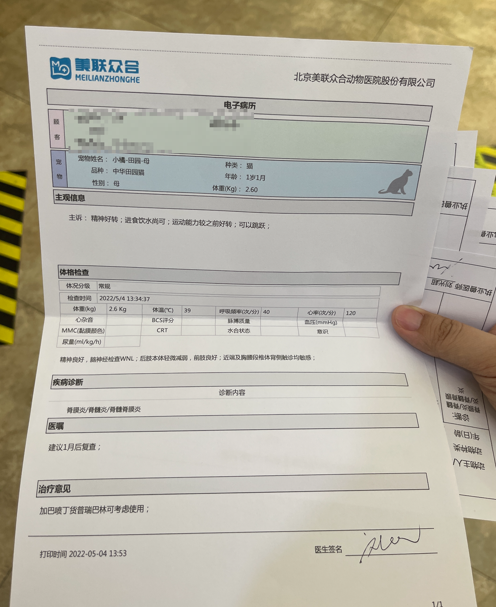

小橘脊髓炎记录

3.9
猫猫
心率低 80
后腿反射慢 前腿正常
体温低 36.5
右眼躲避反射慢

小猫咪都有可能有腰疼

两个方向：结构性损伤 核磁 、内分泌调节问题 化验
高健觉得可能查完也没有结构性损伤，先血检看问题。高健表示，轻度损伤可以自愈，严重损伤也可以在用药三五天左右开始恢复

个人感觉 待观察，可能会自愈？

核磁5000+，检查结构性损伤
脑脊液1500 检查中毒、发炎、病毒、蛋白、弓形虫等，芭比堂国际诊疗中心只能检查猫传腹问题，但是不能检查其他问题，如果检查其他问题需要送检加1200，但是按反馈来看所有送检没有检出过阳性，而且抗生素对这类问题也是有抑制作用的

核磁中

确定 脊髓炎（比较严重） 脑膜炎（没有问程度
可能病因：
1. 猫传腹，需要脑脊液筛查，高医生觉得可能性不大 
2. 自身免疫问题 消炎药、抗生素、抑制免疫类药物

如果是自身免疫问题，治疗周期最短三个月，一般要半年，有可能需要终生服药

大夫划伤了小橘的左前爪，已缝线，需要每日换药，五天左右可拆线，不要碰猫砂，容易感染

日常注意事项？戴圈
上厕所？无
吃饭？无
喝水？无
病历？
发票？
拍脊髓炎、脑膜炎照片？二维码 注意备份
什么时候能打疫苗？非治疗期间

在医院打了一针盐酸阿糖胞苷

3.10
玉泉路第二针盐酸阿糖胞苷
体温37.3
心率120左右

3.11
巅峰罐头里 小橘和阿南都很喜欢马鲛鱼味道的

3.23
第一次复查 小橘紧张 但是大夫觉得ok，脊柱不疼了，腿也正常（之前腿反应慢，疲软）。
开了两个星期的药 下次复查是两星期后
下次复查如果没问题的话，就转为每月一复查即可。整体治疗三月后看情况就可以停药了

打针是每月打一次 所以本次不需要打针

可以下周日（4.3）来复查 没必要等药吃完

体温38.8 
心率测了两次，一次是护士说160左右，另一次高健说120，差别有点大，但反正都还算正常….
体重2.96kg

4.3 第二次复查
体温39.7 偏高，可能是紧张？
开药打针，报销
体温要量耳朵靠外下部
体重2.75，掉了0.2kg体重，大夫说可能是激素问题。

针 打了1ml，已经溶解好了，明天再打1ml即可 需要冷藏

4.4 玉泉路打针
打了1ml，小橘还是很抗拒，看来针是真的挺疼的。
测了体温，38.1，正常了

5.4 美联众合转诊中心复查 刘光超大夫
因为定福庄风控了，所以此次应高健大夫建议来转诊中心复查

刘大夫说小橘胸椎和脊椎都还是敏感，他怀疑还是会疼。建议持续用药（超过三个月）

体重2.6 又轻了，好奇怪

奥美拉唑10mg自购
保肝药无货 需要从其他地方购买，考虑从芭比堂快递？

打完针以后三天内不要接触排泄物 那个药对人有害


充值2000 送160
用掉1500 剩660

米氮平 促进食欲的 每次六分之一片 效果可持续两三天

这美联众合有点墨迹呀 大夫晚了半小时，开药开了半小时。不过态度还行。

5.18
从芭比堂的商城买了个爱肯拿鱼猫粮，花掉储值卡449，剩211	

6.3 定福庄复查
体重2.59kg 大夫说不疼 恢复的挺好的 肌肉量正常

注射阿糖胞苷需要冷藏保存，使用方法为每瓶兑入5ml生理盐水，然后抽1.1ml注射两天

6.4
打了第二针，一切ok

7.1 7.2 继续打了两针阿糖胞苷 一切正常

10月起把猫粮从爱肯拿鸡肉、鱼肉换成了猎鸟乳鸽，小橘和阿南都很爱吃，除了拉屎臭了很多以外，没有什么问题。小橘长胖了很多

2023-02-12

打了第二针疫苗，体重3.2kg，还是有点轻。希望小橘子能快点