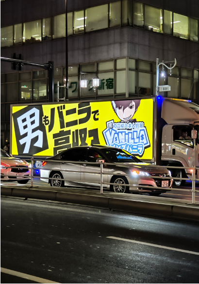
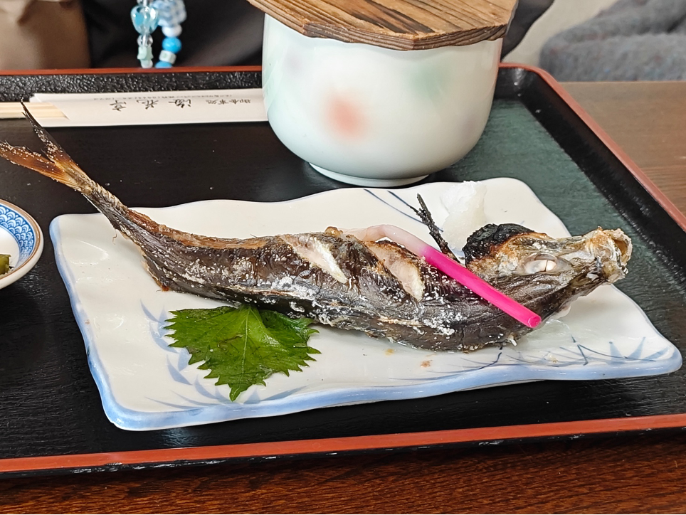

2023五一日本东京圈自由行

2023年的五一是疫情政策常规意义上放开以后的第一个长假，尽管2022的12月就已经基本放开了，但是各种旅行政策还是维持了原样，想出国玩玩还不是很方便。

五一期间终于有机会跑出去看看了，一圈下来感觉还是很舒适的，南姐买到了很多东西，我也刷新了下对日本这个国家模糊的认知。

# 签证

五一时候的日本签证已经实质上放开办理了，我们找到了一个小红书的签证办理方，花了1200+800办了三年签和单次旅游签。

这里插入一个槽点，一开始找了百达旅行社，但是感觉经办人专业性很差，强制要求我们将流水或是收入证明调整至严格匹配，例如收入证明写203200，那么需要流水必须是~20300，如果是21500都不行。反复沟通确认对方意图后，始终不理解对方讲话的逻辑，而且提出的解决方案从根本上就是材料作假，还把锅推给使馆，顿觉不靠谱，选择了退款重新找办理。百达旅行社已经拉黑。

第二次找到的是小红书的经办人，态度很好，有问必答，响应也很快。线上校对好材料后发过去，第二天直接送签，一星期后出签，付款后就把护照快递回来了。整体过程很舒服，沟通也很顺畅，态度和气。未来如果有其他地区签证需求也会继续找他，缺点感觉就是有点贵。

# 行程

## 新宿、新大久保、涩谷

我们住宿的民宿位于新大久保车站步行五分钟的位置，当时定的比较仓促，定完之后才了解到新大久保是韩国街，80%餐饮都是韩餐（当时从Google Map上看到了，不过没多想）。怀着对韩国人的刻板印象、网上看到对新宿卫生状况的各种吐槽（后来看吐槽的没什么问题），我盲猜居住体验不会很好，有一点点懊恼。毕竟每天1k如果还没住好，旅行的基本盘就崩了。

真的到了以后其实还好，确实是典型的外国人聚集地，一出站就是大量的有色人种（韩国人、日本人、中国人、东南亚人、黑人（？）），虽然确实街上也有音量放大的韩语时不时出现，但是比较零星，没有预期的那么夸张。居住地的小房子就是典型的日本公寓了，居住体验蛮好的。内部应该是重新装修过，东西、壁纸都很新，房子在airbnb上刚放出来不久，没什么评价。

    
    

平民天妇罗天花板 天吉屋 1200yen

大久保街上就没那么美好了，有着典型的北京街道的质感，地面上会有脏水、垃圾，甚至有个韩国大姐当着路人就把水泼到了人行道上，颇有一种路过北京街边小店的感觉。涩谷也有类似的情况，感觉是旅游区通病，毕竟游客不关心日本规则，只会纳闷为什么没有垃圾桶，最后的结果就是随手扔垃圾了。

- 新宿的老鼠

    有一天吃东西吃到十二点，回家的时候路上的店面都关了，垃圾对放在外边街道上等待第二天回收。我们居然看到了老鼠成群结队的路过人行道去垃圾袋里找吃的，小老鼠一排一排的，场面还是挺震撼的。毕竟在北京这么多年，都已经很少看到老鼠了，没想到在这儿见到了，而且还是一大串。不过老鼠很怕人，稍微有点动静就跑光了，最后我们匆匆路过，快步回家了。

- 新宿站的人流量震撼

    

 
    新宿站是东京人流量最大的地方了，汇聚了多个不同公司的不同线路，地图上看下就能直观感觉到其复杂程度。其整体结构类似于「王」，中间一竖是南北贯通的关键，并且分叉除了很多分支用于将人流引入到不同的站台上。每个月台又可以对应到不同公司的不同线路，同一条线路还可以细分为各种支线（主体线路相同，部分站点不同），同一个站台还可以根据时间区分为不同的线路。换乘期间可能还需要出站再进站。上述任何一个步骤出问题都坐不上车，简直离谱。对比下来北京换乘太简单了。
 
    

    由于上述种种原因，新宿站的南北通道人流量极其大，去御殿场的那天是日本早高峰（八点），面对对面20人宽的人流直接对向走过来，那个冲击力还是挺震撼的。

    同理，涩谷十字路口的人也是真多，东西向、南北向、交叉线同时过马路，一整个布朗运动混乱有序。牛逼是牛逼，体验确实也不咋好。

    

        
        
    

- 歌舞伎汀牛郎

    

        
        
    

    

 
    看到了满大街跑的牛郎车，也挺震撼的，广告车这种东西可以理解，这么大的广告车宣传这么震撼的事情，配上这么震撼的营收，那确实有点不一样。

    除了牛郎，歌舞伎町北面一条街的拉客姐姐，南姐说旁边的妹妹问大叔「要摸摸我嘛？」，大叔说「多少钱？」，也是挺直接的。拉客特征还是挺明显的，基本上都是大夏天晚上套个羽绒服（底下穿了什么奇怪的东西？）或者直接很明显、暴露的萝莉装。

## 御殿场、富士山

富士山还是挺美的。当然我们是去购物顺便看了下富士山，中午到的时候云彩把雪顶基本上都盖住了，幸运的是过了会儿可以看到一点雪顶了，幸福。

## 镰仓

商业气息比较浓厚，镰仓站一出来就是一条标准的商业街「小町通道」，完完全全就是镰仓版南锣鼓巷，里面有一些小吃、文创品商店，意思不大。不过走到尽头左转有一家镰仓电影资料馆，感觉还蛮有意思的，基本上没什么游客。考虑到我没看过什么镰仓背景的电影，就没有再进去转一圈了，毕竟也要1000yen。 

小电车

街道

另一个来镰仓必去的地方就是江之岛了，把所有路都走一圈的话会比较辛苦，基本上需要三四个小时，其中不乏上上下下的台阶。同样，这里作为旅游景点开发的已经比较完善了，各中小商业很多，不愁吃喝。但是有一说一，作为一个旅游定位的神社，御守都做的不是很好看，有点说不过去。

海中的游轮

江之岛入口处人挤人的商业街

要离开前在一家居民小店吃了烤银鱼和猪排丼，很不错。
 

烤银鱼

猪排丼（どんぶり）

另一个旅游打卡地是镰仓高校前，实在是没什么大意思，除了有强烈打卡情怀的灌篮高手粉丝外，这个地方可能并没有什么特别的。附近就是镰仓高校，很多外来旅游群众可能真的也会叨扰到当地人生活。

当地的学生们放学后在海滩打闹，年轻真好

镰仓高校前的海边

我们这次没有去镰仓大佛，因为不太理解上下文的历史背景，去了的话纯粹看个佛，时间成本上不太划算。总之，感觉镰仓这个地方适合了解镰仓幕府背景的人找一些独特的历史地点去感受。纯粹的打卡旅游的话，坐坐小电车、看看江之岛、高校前打打卡，也就差不多了。

## 东京大学

安静、舒适，有一种古老帝国大学的庄严。让我重新想起了学校的时光，不禁又在想如果能在这样的学校学习该是多么幸福的一件事情。冒出了一个不成熟的想法，想找一个方向，读个博士。但感觉现在是年龄上的黄金期，还是想赚钱第一。

校内巴士

东大的校徽真的蛮好看的

主楼 & 食堂

工学楼

## 千叶 木更津

木更津是这一趟下来我最喜欢的地方，标准的日本乡下，安静、湛蓝的天空和干净的街道给我留下了极其深刻的印象，溜达了四五个小时，在一家海边小店看着其他人在和小狗玩，喝了咖啡、吃了小蛋糕。街道上时不时也能看到有人遛狗，很可爱。

    
    

月亮和云朵构成的小狼

瞎溜达到了村里发现了一个「忠魂碑」，感觉不太对味儿，走近一看果然是日本陆军的立碑。搜了下立碑人「铃木孝雄」，是靖国神社的第四代宫司，也正是他确立了现如今靖国神社的精神地位。目的是为了在战时稳固动荡的人心，试图以靖国神社承接那些死在异国他乡、尸骨无存的士兵。

镇魂碑 铃木孝雄立

## 浅草寺、东京塔🗼
 
emmm 去之前也没有抱很大期待的两个地方，恰好是因为约了朋友在附近吃饭，顺便去了下。

浅草寺也很商业化了，我们出地铁的时候走错了，走到了一个很脏乱差的地下街，看破败程度估计得有四五十年的历史了，整个街道里浸润着一股油脂的味道，十分离谱。浅草寺其实就是个主体比较大的寺庙，但除此以外，和其他寺庙也没什么太大不同，比起国内寺庙来说更是小巫见大巫了。

东京塔就纯粹是地标建筑了，好看确实好看，但建议不要上去，东京塔的高度现在确实太低了。东京塔下的公园歇了一会儿后不行去了趟庆应，比起东大真的小多了，主打政经便不需要很大的场地建设实验室、工学部，只需要图书馆和教学楼便够了。

# 一些其他的思考

## 关于气候

到日本以后最明显的感觉是天空颜色整体蓝了一个度，看东西更透亮些，温湿度比较适宜。

日本应该是亚热带季风气候，且海洋性比较明显，这是的海洋和大陆间始终有空气流动，形成风，可以将大气中的污染物吹散。并且由于没有荒漠地区，风也不会吹起沙尘形成沙尘暴。外加风也可以带着海水蒸发的湿度到大陆，让大陆不至于湿度过低。

整体和北京还是蛮不一样的，排除掉地震因素，东京比北京宜居很多。当然这没有考虑到五六月的梅雨天气，有机会再感受了。

## 关于规则

在从新宿去江之岛的电车上没有两个并排的座位，南姐挑了一个座位坐下后，旁边一个约莫七八岁的小孩子站起来给我让座，据南姐回忆，小孩儿说的「お父さん、どぞ」，虽然不知道为什么用　お父さん　这个称呼，但让位置这个动作让我印象深刻。日本人认为小孩子是最精力旺盛，不应该坐着的，应该给别人让座。他在周围没有父母的情况下，给我主动让座，说明他在家日常接受的教育就是要礼让他人，教育得真好。

## 关于日语

走了一圈下来，感觉又想学学日语了。之前没坚持下来，想了想是因为没有可量化的目标，没找到正确的方法。接下来准备每周一课新标日，走完整的课前预习、上课、习题、总结流程，争取一年后可以拿下N2吧
