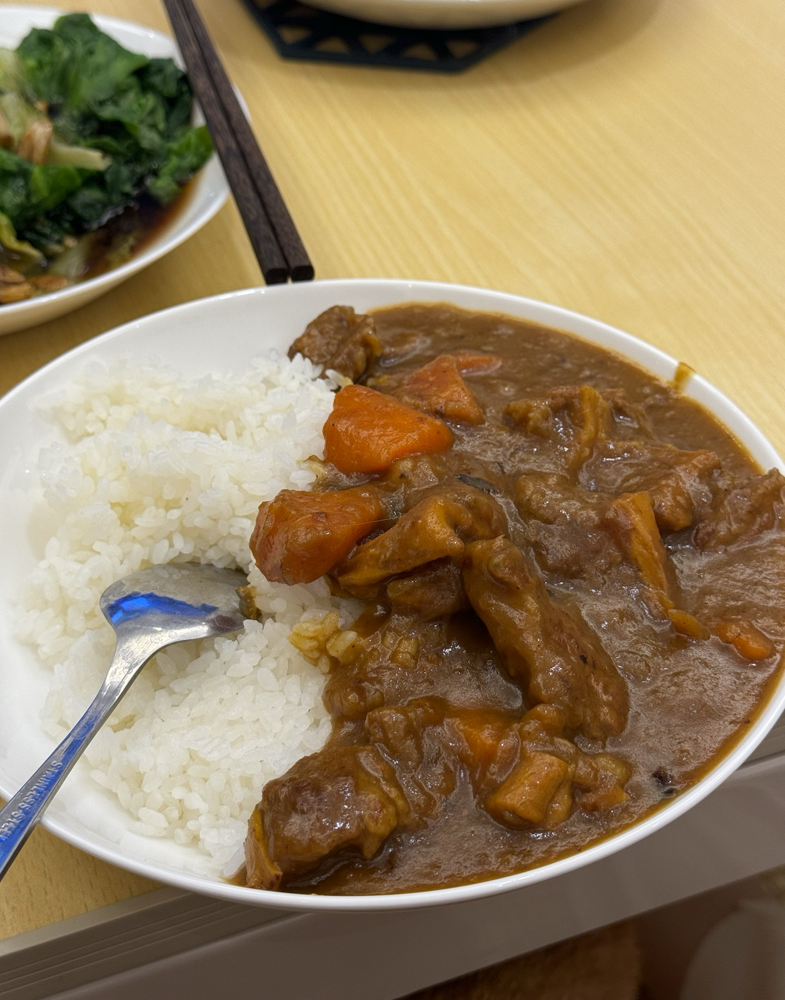
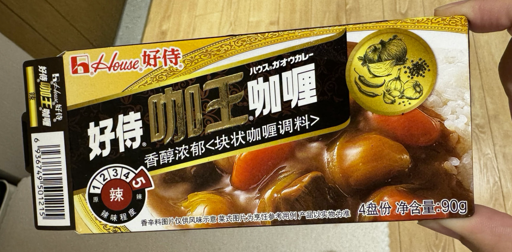
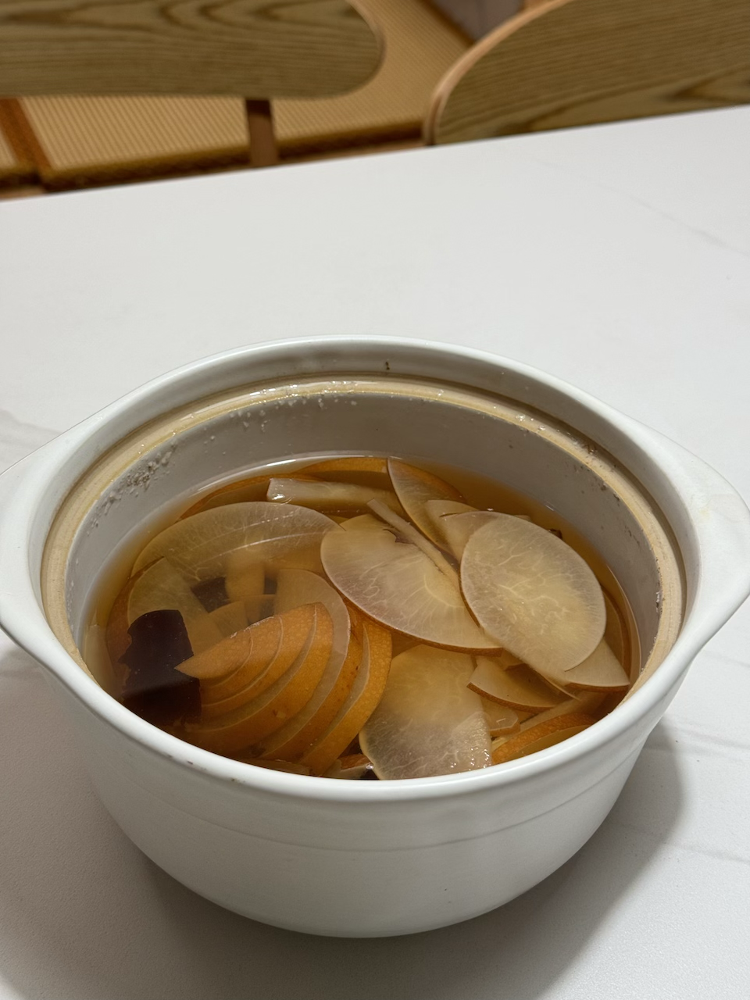

料理.md

# Thoughts

- 做饭的基础维度：刀工、食材处理（腌制、焯水…）、成熟方式（煎炒蒸炸…）、调味（酸甜苦辣咸鲜麻）、秘方（比如煮酸梅汤加盐这种秘方）
- 蒸米饭的米、水比例为 1:1；生米和成品米饭的比例约为 1:2，稍微点几滴香油饭会更粒粒分明
- 去腥三件套：姜、葱、料酒，冷水下锅、大火烧开后撇浮沫（血水）。腌制时去腥的料酒也别太抠，多用点，要不然有腥味很难受
- 少量糖可以提鲜，拌火锅调料、炒菜都可以用到
- 生抽咸味，老抽上色+些许焦糖味
- 料酒本质上是黄酒，选购时可以直接选购黄酒，或选用配料表第一位、第二位为黄酒的产品。相关参考：https://www.bilibili.com/video/BV1mr4y1L7KV 

# 主食

## 炒饼

备料：饼丝、圆白菜、葱、蒜、盐、生抽、味精

- 饼丝用油煎一下炒干水分备用
- 烧油葱蒜爆香
- 下白菜炒软
- 加饼丝翻炒，加生抽、盐、老抽、老干妈、鸡精调味
- 翻炒均匀起锅

## 日式咖喱（三人份）

备菜：
- 咖喱块一盒90g，好侍咖王咖喱块，5级辣度，并不辣
- 洋葱丝，两个白洋葱
- 两个偏小的土豆：一个切小块（用于形成咖喱浓稠感），一个大滚刀块（用于直接吃）
- 两个中等大小胡萝卜，滚刀块
- 牛肉一斤，切大块，牛腱子、牛腩均可

过程：
- 炒洋葱，炒干水分，三四十分钟，到焦化状态，深棕色
    - 如果没那么多时间，可以炒香上色即可，三五分钟（没有实操，待确认对成品影响）
- 煎土豆（2个小的）、胡萝卜（2个小的）、肉，上色
- 所有食材（除大块土豆）挪到不锈钢炖锅
- 加水1L（没过石材即可），放咖喱块，炖至肉软烂（约30min），水收掉合适的状态
    - 由于一开始就放了咖喱块，液体会变浓稠，热水沸腾的力量不足及把石材从锅底扬起来，所以需要每隔三分钟翻拌一次避免糊底
- 准备主食：蒸米饭、烙饼、煮乌冬面
- 加大块土豆，再炖10分钟
- 加酱油调咸味、颜色
- 【可选】加苹果泥引入风味
- 【可选】加蜂蜜调一点甜味和风味
- 【可选】加一点巧克力或咖啡粉引入风味
- 出锅干饭

为什么土豆分小块和大块两次下锅？
咖喱酱汁的颗粒浓稠感（面面的感觉）来源于小土豆块炖烂后的类似淀粉勾芡的效果，为了达成这种效果，小土豆块在首次炖煮过程中是必须的。大土豆块是为了之后还能吃到成型的土豆，不吃可以不加。

咖喱的颜色来源于什么？
咖喱的颜色来源于食材煎上的焦糖色、咖喱块和最后的生抽。

成品

## 鸡蛋面包片

备料：3片原味吐司面包对半切开，3个鸡蛋，酱豆腐

1. 鸡蛋放适量盐打散
2. 平底锅油温7成热
3. 面包蘸鸡蛋下锅把鸡蛋炸开，不用浸太多鸡蛋，不然里面鸡蛋液熟不了
4. 淋上一些鸡蛋液，再把面包片翻面
5. 蘸酱豆腐开餐

## 炒河粉

备料：沙河粉300g，鸡蛋两个，韭黄、豆芽

1. 粉煮熟，淋油
2. 煎一下，煎出焦香
3. 打两个鸡蛋，加盐
4. 鸡蛋下锅炒散
5. 下河粉翻炒出锅气
6. 加生抽老抽调色调味
7. 加韭黄、豆芽断生后出锅

# 面

## 葱香炝锅面

油烧热下葱花爆香，加酱油炸香，加水烧开下挂面，卧鸡蛋，中小火两分半即可

## 葱香炝锅烩饼

油烧热下葱花爆香，加酱油炸香，放入白菜丝翻炒，加水烧开。下饼丝（稍宽点），煮约一分钟，加香油、香菜出锅即可

## 炸酱面

# 汤

## 荸荠水

一斤荸荠，一个小玉米切三四段，四五颗冰糖，二十分钟

## 梨汤

备料：
- 500g秋月梨，去核，切薄片
- 1.5L水
- 两个枣切半
- 【可选】冰糖适量，梨甜的话不用加

下砂锅，开过后小火四十分钟

成品

## 疙瘩汤

1. 撒入少量水到面粉中，筷子绕圈打出小疙瘩
2. 蒜末爆香，炒西红柿，加一丢丢番茄酱，加其他配菜炒断生
3. 加水，多一点，待会儿下面以后会变稠
4. 加盐、鸡精、胡椒粉
5. 撒疙瘩，均匀
6. 加入青菜烫熟
7. 淋入鸡蛋液，出锅

ref: [疙瘩汤虽然家常，但做起来还是有不少技巧的，老师傅教你两种做法_哔哩哔哩_bilibili](https://www.bilibili.com/video/BV1vm4y1A7Gv/?spm_id_from=333.337.search-card.all.click&vd_source=f75eec00741a230b950f46b4337a36c5)

## 酸辣粉

- 红油（使用成品或平替：葱油+豆瓣酱+老干妈）
- 蒜水
- 呛醋（少量油，大量醋烧开，让醋味挥发掉一部分，只留下香味）
- 盐、鸡精、花椒热一下磨成粉

## 冬阴功汤
todo

# 菜

## 宫保虾球、鸡丁

参考老冯宫保鸡丁，重点在于宫爆汁调制、花椒浸炸、辣椒煸香

## 土豆炖排骨

肉焯水，葱姜蒜、香叶、花椒、八角、干辣椒爆香下排骨翻炒，下豆瓣酱翻炒，加水没过排骨即可，加葱段、山楂（让肉炖的更）炖30分钟，下土豆、五六颗冰糖再炖10分钟

不用豆瓣酱，换成老抽、生抽就是红烧口味

## 西红柿牛腩
todo

## 玉子蛋

热水烧开后关火，放入无菌蛋，静置半小时，拿出后浸泡在冷水中降温即可。

## 蒜蓉粉丝娃娃菜

蒜末，小米辣切碎爆香，加生抽蚝油烧一下，加入适量开水做汤汁（汤汁稍微多一些，不然出锅以后没有汤汁的菜叶会寡淡）。粉丝垫底，娃娃菜铺好淋上汤汁，大火蒸15分钟

## 白灼菜心

1. 菜心焯水（加盐、油）后摆盘，焯半分钟即可，太久容易软掉没有口感
2. 起锅烧油下入蒜瓣爆香，加生抽爆香，加适量水、耗油、鸡精、半勺糖，烧开后关火
3. 汤汁浇在菜心上即可

## 炝炒圆白菜

1. 圆白菜洗净切成宽片或手撕成小片
2. 备料：蒜片、大葱片、花椒、干辣椒
3. 油热下上述辅料，爆香后加入圆白菜，简单翻炒几下
4. 加入生抽、盐、糖、鸡精，翻炒至白菜变软即可出锅

## 酸甜风格拌菜

1. 各种菜洗净，需要焯水的提前盐、油焯水
2. 加入1:1的生抽和醋，加入糖、鸡精
3. 加入基础调味：小葱段、香菜、洋葱，搅拌均匀
4. 可以加少量孜然，风格类似凉拌熏鸡架

# 火锅

## 羊蝎子

两人份
- 老诚一锅大分羊蝎子一份
- 【可选】一斤羊尾巴
- 糖蒜一头

涮菜：
- 菠菜
- 蒿子秆
- 冻豆腐
- 宽粉
- 素丸子

主食：
- 面

## 寿喜锅

基础材料：
- 调味汁
- 无菌鸡蛋
- 黄油
- 大葱
- 洋葱
- 娃娃菜
- 卤水豆腐（提前煎制成煎豆腐）

涮：
- 牛肉
- 响铃卷
- 绣球菌
- 香菇
- 金针菇
- 魔芋丝
- 竹轮
- 鱼饼

## 日式大肠锅

备料：
1. 大肠锅底料
2. 牛小肠，对的，是小肠...
3. 干辣椒、大蒜
4. 必备菜：圆白菜、豆芽、韭菜
5. 可选菜：煎豆腐
6. 乌冬面

参考: https://www.xiaohongshu.com/discovery/item/620657240000000001024d88

# 锅具

- 平底不粘锅：日常使用，避免铁铲、硬质食材（排骨等）
- 熟铁锅：日常使用，避免酸性食材（西红柿），刷完需要烤干
- 铸铁锅：煎牛排等，刷完需要烤干
- 雪平锅：焯水、煮面、炸物
- 不锈钢煮锅：炖肉、咖喱等，加笼屉就是蒸锅

# 美食大全

- 羊蝎子：浩爷、蝎王府
- 生蚝：蚝英雄
- 日料：胜博殿（咖喱）、双马（咖喱）
- 铁板烧：水木锦堂
- 烤肉：原始泥炉烤肉
- 烤羊腿
- 四川火锅：谭鸭血、巴奴
- 潮汕火锅：重八牛府（牛肉丸）
- 烤鱼：锦绣阁
- 牛排：牛排家
- 烧烤：小龙虾
- 卤味：鸭头、鱿鱼
- 猪脚饭
- 泰餐
- 饺子：袁记云饺
- 天妇罗
- 蛋炒饭、炒饼
- 板面
- 刀削面
- 炸酱面
- 汉堡：悠航、京A

## 待探店
- 玉华台 淮扬菜 山石脆鳝

