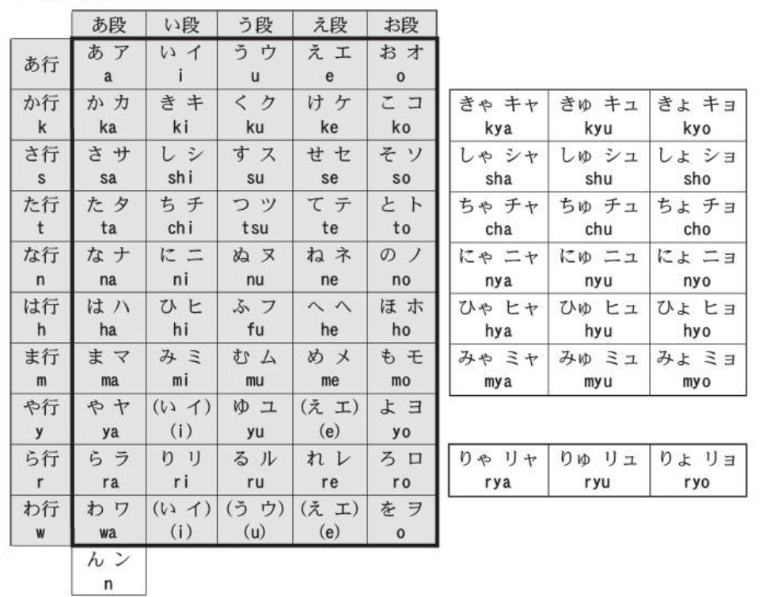

# 五十音图
 
 

 

 
## 难音列表

1. 尾音不要吞音
2. 音调：0 1 2 3 4
3. 节奏，每个音的长度要一致，尤其是ん、い

# Tips

不需要鼻浊音，显得老气，基本上年轻人都不发这类音了

【个人感觉】い う 在单词中发挥的是长音作用，延长上一个音的发音。正常来讲每个音是一个音节，加上这两个音会变成两个音节

はい只表示应答，只有「分かりました」才是真正的表示肯定

音读：和中文发音类似，是古时候文字传入日本时候的发音
训读：日本自己的音

日语中的名词+名词一定要加の，例如「日语书」是「日本の本（hon）」

自我介绍：公司名称の名字

日文片假名中的v替换为b，例如电视中的v，television -> テレ**ビ**

です　ですか 的使用范围比中文的「是」要广很多，本质上是谓语助词，可以说「森さんは一階です」表示「森先生在一层」，而不是「森先生是一层」

日语中如果没有出现明确主语，那主语就是讲述人。

表示存在性，有、在
- あります　不具有意志的事物，花、草、桌子
- **も** ありません：表示全面否定：駅にん何もありません 站里什么也没有
います 人、动物
- **も**　いません：全面否定

に 有位置状语从句助词的作用，表示存在性的位置，例如：
- **部屋に**机**が**あります： 房子里有桌子：地点状语在前时助词变为　が
- 机は**部屋に**あります：桌子在房间里
- 鎌倉は**神奈川に**あります
但是对于动作发生的场景，使用 で 做助词
- 李さんは図書館で勉強します

に　还有时间状语标志的作用，表示事件发生时间，例如：
- 森さんは**7時に**起き ます
可以使用　ごろ 替代，表示大概时间，例如：
- 森さんは**７時ごろ**起きます　森先生大概七点起床

に　还可以表示动词目标人物的助词
- 私はおかさん**に**お土産をあげいました　我给了母亲礼物
- 私駅で森さん**に**会いました 我在车站碰到了森先生

ください　please give me 

动词 + ます　「negative」ません　描述当前、未来或习惯性动作
动词 + ました　「negative」ませんでした　描述过去时的动作

【时间、地点名词】 + から：从~开始
【时间、地点名词】 + まで：到~结束
- 森さんは９時**から**５時**まで**働きまし
- 森さんは日本**から**広島**まで**新幹線で行きます

いつ「动词」ましか　when。
例如：試験は**いつ**始まりますか。
或者更具体的：何時「なんじ」　何曜日「なにょうび」　何日「なんいち」

へ：配合「行きます」「帰ります」表示移动目的地时，做地点的助词，发音 え
李さんは中国**へ**行きます

【名】を【动】　表示动词发生的对象是名词

で 的用法
- 乘坐交通工具： 李さんは新幹線**で**東京にいきます
- 在【地点】做【动作】：李さんは図書館**で**勉強します
- 用某些方法、原材料：李さんは日本語**で**手紙「てがみ」を書「か」きます　小李用日语写信

一类形容词
以い结尾的，例如 辛「から」い　冷「つめ」たい　
- 普通：四川料理は辛いです
- 否定
  - （い　→ く）　＋　ないです　or ありません
  - 辛くないです　辛くありません
- 过去时
  - （い　→　かつた）　＋　です
  - 旅行「りょこ」は楽「たの」し**かつた**です
- 过去否定
  - （い　→ く）　＋　なかつたです　or ありませんでした
  - 昨日は寒くなかったです
- 可直接修饰名词
  - 白「しろ」い紙「かみ」

二类形容词
通常，不以い结尾的形容词为二类形容词，但也有一部分二类词以い结尾，需要注意。
この 通「とお」り は 静「しず」か です

- 否定： じゃない、では　ありません：　この通りは静かじゃありません
- 过去：でした　昨日は雨「あめ」でした
- 过去否定：では（じゃ）　ありません　でした：昨日は暇「ひま」じゃありませんでした

形容词询问
- 什么样的： どんな：横浜はどんな町ですか
- 怎么样（获取评价）：どうですか：この料理はどですか

形容词句式
- 【名词1】は【名词2】が【形容词1、2】です
  - 小野さんは歌「うた」が好きです　小野女士喜欢唱歌
  - 林さんは犬「いぬ」怖「こわ」いです　林先生害怕狗

形容词总结

程度副词
- とても　很、非常
- たいへん 很、非常
- 少「すこ」し、くょっと　a little bit
以下为否定修饰
- あまり〜【形容词否定太】　不太~
- 全然「ぜんぜん」〜【形容词否定太】 完全不~

频率副词
- いつも：一直
- よく：经常
- 時々「ときどき」：时不时
- たまに：偶尔 私は**たまに**大学へ行きます　我经常去大学
否定修饰词
- あまり〜ません：不太~
- 全然〜ません：完全不~

转折 
- でも　偏口语：私の部屋は狭いです。でも、**綺麗**です　我的房间很小，但很干净
- けど　although

并列
- そして：私の部屋は狭「せま」いです。そして、汚「きたな」いでう

ところで　转移话题：ああ、そですか。ところで、この美術館にはどなんですか

和
- と 完整列举项目：中国と日本　中国和日本
- や 表示全集的一部分： 中国や日本　中国呀、日本呀等等

因果关系
- から 因为
- だから　所以
- 【敬】ですから

为什么 why
- どうして ~ ですか

【名】か【名】: 〜或者~：休「やす」み は月曜日か火曜日です　（周一或周二休息）

比较
- 【名1】は【名2】より【形容词】です ：1 比 2 更 ~
  - 李さんは森さんより若いです
- 【名1】より 【名2】**の　ほう　が**【形容词】です ： 比起 1，2 更 ~
  - 日本より、中国のほうが広いです
- 【名】の　中　で 【名】〜　が　いちばん　です： ~中，~是最~的
  - ビール中で　朝日は一番好きです
- 【名1】は【名2】ほど【形容词否定】：1不如2~
  - 神戸は大阪**ほど**にぎやか**ではありません** 神户没有大阪繁华
- 〜と〜と　どちら　が【形容词】ですか　：二选一询问
  - 日本語と英語と　どちらが難しいですか
- 【范围】の中で　【どの、どれ、だれ、いつ、何】が【形容词】ですか
  - 季節の中で　**いつ　が**　いちばん 好き ですか

【动词て型】【动词て型】：表示多个动作先后发生，一般使用该方法连接动词不超过三个，三个以上容易混乱，可以加一个 それから 

【场所】へ【动词原形】に　行きます / 来ます：表行为的目的，到（哪儿）做什么 
- 例：午後　郵便局へ　荷物「にもつ」を　出「だ」しに　行きます　下午去邮局寄包裹

【人】は【动词基本型】ことができます  ：能做~
【人】は【动词基本型】ことができません：不能做~

【动基】前に、〜： 在~之前，~~
- こちらへ来る前に、電話おかけてください　来这儿之前打个电话
也可以换成名词：会議**の前に**、資料おコピー（copy）します　会前复印好材料

# 单字

- と 和：時計と眼鏡
- 生 せい
- 人 じん
- 本　ほん
- 何 なん(what)　なに(how many)
- 方　kata： 用于替代『人』的替代词，更礼貌。例如：JC企劃の方ですか？
- 大　だい
- 第　だい
- 桃　もも
- 店 てん
- 員　いん
- 歳　さい
- 島　しま
- 駅　えき
- 今　いま
- 時　じ
- 分　ふん
- 毎　まい
- 最　さい
- 
- 
- 
- 
- 
- 
- 
- 
- 
- 
- 
- 
- 
- 
- 
- 
- 
- 
- 
- 
- 
- 
- 

# 単語

- お　尊敬的通用前缀
- かばん　包
- 学生　がくせい
- 先生　せんせい
- 大学　だいがく
- 言葉　ことば 语言
- 速い　はやい 快速的，例如走得快、工作干得快
- 早く　はやく 快点、早点
- 複雑　ふくざつ 复杂
- 難し　むずかし 困难
- 次の　つぎの　下一个
- 企劃　きかく
- どうぞ　请
- 写真　しゃしん
- お土産　おみやげ　礼物
- 中国　ちゅうごく
- 電話　でんわ
- 携帯電話　けいたいでんわ　手机，一般简称为　けいたい
- 傘　かさ
- 新聞　しんぶん　**报纸**
- ニュース　**新闻**
- 机　つくえ　**桌子**
- 椅子　いす　
- かき　钥匙；（在部分场景里）锁
- 時計　とけい　表、钟
- 手帳　てちょう　笔记本
- 車　くるま　汽车
- 自伝社 じでんしゃ　自行车
- 英語　えいご
- 銀行　ぎんこう
- 売り場　うりば　卖场
- 本屋　ほにゃ　书店
- 受付　うけつけ 接待处
- 午前　ごぜん　上午　
- 午後　ごご　 下午
- 毎日　まいにち
- 明日　あした
- 今日　きょう
- 昨日　きのう
- 朝　あさ　早晨
- 働き　はたらき　工作
- 勉強　べんきょう　**学习**
- 行きます　いきます　去
- 帰り　かえい　回来
- 読みます　よみます　读
- うち　家
- いつも　一直、一贯
- 手紙　てがみ　信
- もう　表示完了，类似汉语「已经」　もう、食べました
- 失礼「しつれい」しまし　【敬】告辞
- 迷「まよ」い　犹豫： 何お食べまうか。　迷いますね
- いろいろ　各种各样的
- します　做~ 比较通用，类似英文do、make，例如　会議をします　开会、宿題をします 做作业
- おいくつ　多少岁
- どなた　【敬】谁
- お名「な」前「まえ」は  您的名字是？
- こちらは〜　这是~
- 医者「いしゃ」　
- 病院「びょういん」
- お手洗い　「おてあらい」
- 中「なか」　
- 最近「さいきん」
- 広い「ひろい」 广阔
- 綺麗「きれい　0」
- 一人暮らし　ひとりぐらし　一个人住
- 働き　はたらき　工作
- 
- 
- 
- 
- 
- 
- 
- 
- 
- 
- 
- 
- 
- 
- 

- 亲属
  - 家族　かぞく
  - おじさん 祖父
  - おばあさん 祖母
  - お父（とう）さん
  - お母（かあ）さん
  - 息子（むすこ）さん 儿子
  - 娘（むすめ）さん 女儿
  - お兄（にい）さん 哥哥
  - お姉（ねえ）さん 姐姐
  - 弟（おとうと）さん 弟弟
  - 妹（いもうと）さん 妹妹

片假名
- ビル　building
- 
- 
- 
- 
- 
- 
- 
- 
- 
- 

## 数字

いち　に　さん　よん　ご　ろく　なな　はち　きゅう

百　ひゃく
千　せん　
万　まん　
1億　いちおく

## 周几

水曜日　すいようび　３
木曜日　もくようび　４

日曜日　にちようび　７

何曜日にですか

## 方向

上　うえ
下　した
中　なか　in
外　そと
隣　となり　beside
近く　ちかく　near

## 代词

- 指代，后面要加名词
  - この 这个
  - その 那个
  - あの 那个（更远）
  - 例子：この本は私のです
- 指代主语，后面不需要加名词
  - これ 这个
  - それ 那个
  - あの 那个（更远）
  - 例子：これは桃です

## 疑问
- 誰（だれ）、【敬】どなた who 
- 誰の whose 
- どれ　どの　which 
  疑问句 which 中，单独使用的场景用 どれ，后续接接名词使用 どの
- どして　why
- どうな　什么样的，偏形容词 
- どうですか　how about 怎么样，偏主观感受，过去时为 どうでしたか

## 地点指代

ここ 【敬】こ**ちら**　这里
そこ 【敬】そ**ちら**　那里
あそこ 【敬】あ**ちら**　那里（比そこ更远）
どこ 【敬】ど**ちら**　where 哪里

# 例句

お母さんは**おいくつ**ですか　【敬】您母亲多大年纪了？

これは**いくら**ですか。　这个多少钱？ how much 

# 语法

## 陈述

A は　B です
私は学生です

A も　B です
作为助词，も表示「也」的意思

## 否定

A は　B ではありません
否定，偏正式。
口语说法可以替换为：　A は　B じゃないです

## 疑问

A は　B ですか。
疑问句，日语里一般不用句号，仍然用句号。

それは何でしか。

## 尽管

todo

## 转折

でも

## 时态

### 现在时

动词原形表示 ~る

### 过去时

た ： 昨日（このう）何食べた

### 将来时

日语中没有特定将来时时态

### 进行时

**てい**る（ています）　ていない（ていません）

### 过去进行时 

**てい** た

# GPT prompts

>「」在日语中的作用是什么，解释并给出一些例句

> 翻译并分析这句话的语法及单词：

> 翻译为日文、注音并解释语法：

# ref

- [如何看待叶子老师在B站上进行新标日的教学？ - 卫旭的回答 - 知乎](https://www.zhihu.com/question/49206413/answer/115219749)