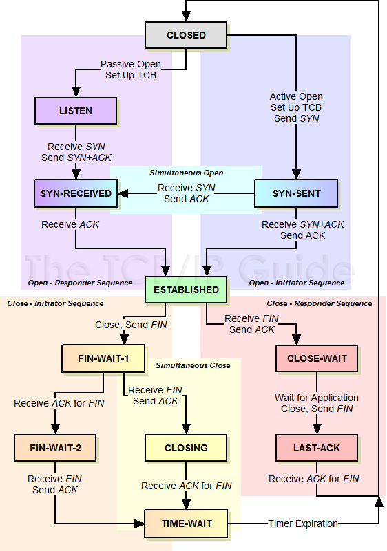

## 四层模型、七层模型每一层是什么？做了什么？应用？

下面这张图需要注意的几个协议：

- 应用层
HTTP(80)、FTP(20数据端口，21控制端口)、SSH(22)、HTTPS(443)
- 会话层
SSL/LDAP
- 网络层
**ARP**属于网络层协议，下图有错。仔细想想ARP的作用是通过IP获取MAC地址，不可能只工作在数据链路层。
IP ICMP IGMP


## TCP 状态机




## TCP/UDP区别？
| TCP | UDP |
| --- | --- |
| 面向连接 | 无连接 |
| 可靠传输 | 不可靠传输 |
| 拥塞控制 | 无 |
| 面向字节流 | 面向报文 |
| 只支持点对点 | 支持一对一、一对多、多对一、多对多 |
| 20首部字节 | 8首部字节 |


## TCP如何实现可靠传输？


校验和、确认机制、超时重传的方式实现可靠传输。


## TCP如何实现拥塞控制？


通过滑动窗口的机制，通过动态发送窗口的大小进而控制发送速率的**TCP拥塞控制算法**，发送窗口又是由本地的拥塞窗口和接收端的接收窗口中的较小值决定的。发送过程中，拥塞窗口大小会根据ACK报文的接收情况发生变化，具体涉及到算法有**慢启动、拥塞控制、乘法减小、快速恢复**。


- 慢启动
每接收到一个ACK，拥塞窗口大小加1，即每个RTT（报文往返时间，Round Trip Time）拥塞窗口翻倍。
- 拥塞避免
当拥塞窗口大小超过指定阈值时，每个RTT拥塞窗口只加1。
- 乘法减小
当出现报文超时，阈值减小到原来的一半，拥塞窗口重置为1，重新开始慢启动过程。
- 快速恢复
当收到连续三个重复ACK时（不同于超时），不等待超时，直接**快重传**这个丢失的报文，然后将阈值减半，拥塞窗口大小重置为减半后的阈值大小，随后执行拥塞避免算法。
这里之所以不重新慢启动，是因为如果可以连续收到三个ACK，表明网络情况并不是很差，而只是意外丢失了一个报文段，所以无需重置拥塞窗口而只要稍微限制发送即可。


## TCP三次握手过程？为什么需要三次握手？


一种常见说法：

在谢希仁著《计算机网络》第四版中讲“三次握手”的目的是“为了防止已失效的连接请求报文段突然又传送到了服务端，因而产生错误”。在另一部经典的《计算机网络》一书中讲“三次握手”的目的是为了解决“网络中存在延迟的重复分组”的问题。这两种不用的表述其实阐明的是同一个问题。

谢希仁版《计算机网络》中的例子是这样的，“已失效的连接请求报文段”的产生在这样一种情况下：client发出的第一个连接请求报文段并没有丢失，而是在某个网络结点长时间的滞留了，以致延误到连接释放以后的某个时间才到达server。本来这是一个早已失效的报文段。但server收到此失效的连接请求报文段后，就误认为是client再次发出的一个新的连接请求。于是就向client发出确认报文段，同意建立连接。假设不采用“三次握手”，那么只要server发出确认，新的连接就建立了。由于现在client并没有发出建立连接的请求，因此不会理睬server的确认，也不会向server发送数据。但server却以为新的运输连接已经建立，并一直等待client发来数据。这样，server的很多资源就白白浪费掉了。采用“三次握手”的办法可以防止上述现象发生。例如刚才那种情况，client不会向server的确认发出确认。server由于收不到确认，就知道client并没有要求建立连接。”

另一种说法：

1. A发，B收， B知道A能发
2. B发，A收， A知道B能发收
3. A发，B收， B知道A能收

发和收设计到了主机资源分配和网络链路上的一系列策略影响，双方彼此确认发收能力也是必要的。

其实上述两个说法都有道理，但是第一种说法也是`RFC 793`给出的原因，更权威一些：

>   A three way handshake is necessary because sequence numbers are not tied to a global clock in the network, and TCPs may have different mechanisms for picking the ISN's.  The receiver of the first SYN has no way of knowing whether the segment was an old delayed one or not, unless it remembers the last sequence number used on the connection (which is not always possible), and so it must ask the sender to verify this SYN.  The three way handshake and the advantages of a clock-driven scheme are discussed in [3].
> 
> ...
>
> The principle reason for the three-way handshake is to prevent old duplicate connection initiations from causing confusion.
>
> ref: https://www.ietf.org/rfc/rfc793.txt

所以，无论如何一定要三次握手才能保证连接的顺利进行。

如果A发给B的确认丢了，该如何？A会超时重传这个ACK吗？不会！TCP不会为没有数据的ACK超时重传。

那该如何是好？B如果没有收到A的ACK，会超时重传自己的SYN同步信号，一直到收到A的ACK为止。

三次握手的情况下，如果服务器端接到了客户端发的SYN后回了SYN-ACK后客户端掉线了，服务器端没有收到客户端回来的ACK，那么，这个连接处于一个中间状态，即没成功，也没失败。于是，服务器端如果在一定时间内没有收到的TCP会重发SYN-ACK。在Linux下，默认重试次数为5次，重试的间隔时间从1s开始每次都翻倍，5次的重试时间间隔为1s, 2s, 4s, 8s, 16s，总共31s，第5次发出后还要等32s才知道第5次也超时了，所以，总共需要 1s + 2s + 4s+ 8s+ 16s + 32s = 63s，TCP才会断开这个连接。

上述解释参考

- [TCP 为什么是三次握手，而不是两次或四次？ - 车小胖谈网络](https://mp.weixin.qq.com/s/NIjxgx4NPn7FC4PfkHBAAQ)
- [传输控制协议 - WiKi](https://zh.wikipedia.org/wiki/%E4%BC%A0%E8%BE%93%E6%8E%A7%E5%88%B6%E5%8D%8F%E8%AE%AE)


## TCP四次挥手过程？为什么需要四次挥手？最后的等待确认时间为什么是2*MSL(Maximum Segment Lifetime)？


四次挥手的原因和三次握手基本相同，每两次操作断开了全双工中一方的通道，由于连接建立过程中没有数据传输，所以可以合并为三步，但是客户端断开连接时服务端可能有数据尚未传输完，所以必须需要四步才能完整的断开连接。如若没有最后一个客户端发送的ACK，服务端直接关闭，那么这条最终的FIN报文并不能确定传输到客户端，客户端也就不能正常关闭该连接，这会影响到后续新连接的建立，服务端不能确定之后的报文是新的请求还是来源于上一个已关闭的连接的报文。

最后2*MSL等待时间是为了客户端确认自己的断开连接确认报文送达了，如果客户端的ACK未送达，则服务端会重发FIN报文。这个时间时考虑到了服务端没有收到ACK报文因而重发FIN报文的时间（1 MSL）加上ACK到达服务端的最长时间（1 MSL）。


## TIME_WAIT是什么？为什么要有TIME_WAIT？TIME_WAIT状态的连接过多会怎么样？怎么解决TIME_WAIT过多的问题？

TIME_WAIT：断开连接的**客户端**在返回最后的ACK报文后，需要等待一段固定时间再关闭连接，这段时间客户端就会处于TIME_WAIT的状态。

存在的意义？本质上是为了正常断开连接，目的有二：

1. 释放资源（端口、内存等，主要是服务端的），否则新的SYN报文会被拒绝
2. 确认连接真的断开了，防止上一个连接延迟在网络中的报文对下一个连接产生影响（虽然概率不大）

出现在什么场景？服务作为客户端并发度很高，并且开启了大量的短连接。

过多会怎样？大量端口资源被占用，从而导致新连接无端口可用，请求并发数收到很大限制。

解决方案？
- 使用长链接，例如http中的keep-alive等
- 手动设置中降低TIME_WAIT的时间；
- 或者开启TIME_WAIT状态的端口重用或快速回收，但是这样好像会导致一些[未知的问题](https://www.cnxct.com/coping-with-the-tcp-time_wait-state-on-busy-linux-servers-in-chinese-and-dont-enable-tcp_tw_recycle/)。


## CLOSE_WAIT是什么？为什么可能出现很多CLOSE_WAIT状态？CLOSE_WAIT状态的连接过多会怎么样？怎么解决CLOSE_WAIT过多的问题？


CLOSE_WAIT：**服务端**在接收到发送方的FIN报文后，如果目前还有数据没有发送完成，则会选择继续发送，在这段时间内，服务端的状态为CLOSE_WAIT，发送完后服务端会发送FIN报文，随后等待客户端ACK报文，进入LASK_ACK状态。


为什么会出现很多CLOSE_WAIT？如果程序中没有**手动关闭socket**，那么服务端并不会发出FIN，此时TCP连接需要被动地等到超时才能断开连接，此时持有的资源也不会释放。


过多会怎样？大量的资源（端口、内存等）被占用，导致新连接无法建立。


怎么解决？编程时注意手动关闭socket。


## GET/POST异同？


语义不同：GET一般为请求资源；POST为更新资源


参数不同：GET的参数在URL上；POST的参数既可以在URL上，也可以在请求体中


安全方面：因为参数位置的缘故，POST请求安全性相对来说好一些


长度限制：GET受限于最大URL长度；POST无限制


## 浏览器输入域名到返回页面发生了什么？


1. DNS查询指定URL，如果本地有缓存则使用本地缓存，如果无缓存则查询DNS服务器。
1. DNS服务器检查本地是否有这个域名对应的IP，如果有则返回；如果没有则递归或迭代查询上层DNS服务器
1. 建立TCP链接，封装HTTP请求和TCP报文，发送至服务器（一般是负载均衡服务器）
1. 反向代理服务器将请求打到对应的服务器
1. 服务端根据业务逻辑获取对应资源，返回数据，如果是后端渲染则返回渲染后的页面，如果是前后端分离的一般是序列化后的数据
1. 浏览器解析HTML，构建DOM树，对遇到的每一个资源再次执行上述过程
1. 如果前端还有渲染行为，则进行前端渲染，随后结束


底层可能还有其他操作：


- ARP寻找下一跳硬件地址，在链路中传递
- NAT转发
- CDN缓存
- HTTPS


## 网络层协议ARP的工作流程？


ARP是一个根据IP地址获取物理地址的协议。流程如下：


1. 首先源主机会检查本地ARP缓存是否已有数据，如果有则直接使用；如果没有，继续
1. 在自己所在的网段发起一个ARP请求的广播，ARP请求包含了源主机的IP地址、硬件地址和目标主机的IP地址
1. 收到该广播的主机会检查这个目标IP和自身是否相同，如果不同则丢弃；如果相同，目标主机进行下一步
1. 目标主机首先将源主机的IP和硬件地址加入到自己的缓存中，然后发送ARP返回报文
1. 源主机收到返回报文，将目标主机的IP和硬件地址加入到缓存，并且使用此地址发送信息；如果源主机始终没有收到返回报文，则查询失败。


## Cookie和Session的异同


关系上来讲，Session一般依赖于客户端存储在Cookie中的数据实现；如果Cookie被禁用了，可以通过URL回传SessionId实现。Cookie和Session的对比如下：

|  | Cookie | Session |
| --- | --- | --- |
| 存储位置 | 客户端 | 服务器 |
| 限制 | 个数、容量受限于浏览器 | 无限制 |
| 安全性 | 相对较差 | 安全 |
| 消耗 | 对服务器无消耗 | Session过多会增大服务器负载 |


## 跨站脚本攻击(Xss, Cross Site Scripting)


通过在正常页面嵌入攻击者的脚本实现攻击，例如用户输入的内容包含了HTML标签和JS代码。防范方法是对用户提交的内容过滤，永远不要信任用户的输入。


## HTTP常见状态码？200/201/202/204/206/301/302/304/400/401/403/404/500？

- 100 Continue：服务器已经接收到请求头，并且客户端应继续发送请求主体（在需要发送身体的请求的情况下：例如，POST请求），或者如果请求已经完成，忽略这个响应。服务器必须在请求完成后向客户端发送一个最终响应。
- 101 Switching Protocols：服务器已经理解了客户端的请求，并将通过Upgrade消息头通知客户端采用不同的协议来完成这个请求。在发送完这个响应最后的空行后，服务器将会切换到在Upgrade消息头中定义的那些协议。最典型的是HTTP 1.1切换至WebSocket
- 200 OK：正常成功
- 201 Created：请求创建的资源已创建
- 202 Accepted：请求已接受但还未被处理，请求的操作可能并不会成功
- 204 No Content：服务器正常处理了请求，且不需要返回信息
- 206 Partial Content：服务端返回了部分数据，用于断点续传一类的需求
- 301 Moved Permanently：永久重定向
- 302 Found / Moved Temporarily：临时重定向
- 304 Not Modified：服务器表示Get请求的对象从上次请求没有改变，可以使用缓存
- 400 Bad Request：请求错误，语义或参数
- 401 Unauthorized：请求需要验证身份才能继续执行
- 403 Forbidden：服务器拒绝执行请求，与401不同的是验证信息并不能对这个请求提供帮助
- 404 Not Found
- 405 Method Not Allowed: 请求的HTTP方法不支持
- 408 Request Timeout：链接建立后客户端未能在一定时间内向服务端发送请求，服务端则主动关闭链接，返回408状态码
- 413 Request Entity Too Large：请求体过大，服务端无法处理，例如上传了过大的文件
- 414 Request-URI Too Long：请求URI过长，服务端无法处理，一般是GET请求参数过大导致超长，需要转换为POST请求，比较少见
- 415 Unsupported Media Type：content-type不受服务端支持
- 429 Too Many Requests （RFC 6585）：用户在给定的时间内发送了太多的请求。旨在用于网络限速
- 499 HTTP_CLIENT_CLOSED_REQUEST: Nginx定义的状态码，访问路径`client -> nginx -> server`中，如果ngixn从server获取到响应时client已经因超时关闭了链接，则nginx记录为499状态码，但该状态码不会返回给client
- 500 Internal Server Error：服务器执行时发生了异常
- 501 Not Implemented：服务端尚未实现指定功能
- 502 Bad Gateway：网关没能成功访问到下游服务
- 503 Service Unavailable：服务器当前不可用，稍后可能会恢复，出现在过载时
- 504 Gateway Timeout：作为网关或者代理工作的服务器尝试执行请求时未能在有效时间内收到响应


## HTTP1.1/2.0/3.0各自改进了什么？


HTTP1.1的主要改进:


- 长连接：避免了TCP握手的时间开销
- 强制要求的HOST请求头字段，应对一台服务器（一个IP地址）部署了多个域名服务的情况，服务器需要通过HOST字段区分服务
- 更丰富的缓存策略：HTTP1.0只支持`If-Modified-Since`
- 100的临时状态码：表示服务器已经收到了请求的一部分，正在接受其他部分


HTTP2.0三个主要特性：


- 多路复用：多个请求可以连续发送而不必一个一个等待返回，提高了并发度，通过将请求的信息封装为二进制帧实现。
- 头部压缩：省略公共字段、字符串使用**huffman编码**
- 服务端推送：服务端提前推送客户端可能使用到的数据，预先缓存

HTTP2.0实际上已经是「有状态」协议了，每一个HTTP2.0连接（Stream）会有自己的状态机，如下：


```
RFC 7540                         HTTP/2                         May 2015


5.1.  Stream States

   The lifecycle of a stream is shown in Figure 2.

                                +--------+
                        send PP |        | recv PP
                       ,--------|  idle  |--------.
                      /         |        |         \
                     v          +--------+          v
              +----------+          |           +----------+
              |          |          | send H /  |          |
       ,------| reserved |          | recv H    | reserved |------.
       |      | (local)  |          |           | (remote) |      |
       |      +----------+          v           +----------+      |
       |          |             +--------+             |          |
       |          |     recv ES |        | send ES     |          |
       |   send H |     ,-------|  open  |-------.     | recv H   |
       |          |    /        |        |        \    |          |
       |          v   v         +--------+         v   v          |
       |      +----------+          |           +----------+      |
       |      |   half   |          |           |   half   |      |
       |      |  closed  |          | send R /  |  closed  |      |
       |      | (remote) |          | recv R    | (local)  |      |
       |      +----------+          |           +----------+      |
       |           |                |                 |           |
       |           | send ES /      |       recv ES / |           |
       |           | send R /       v        send R / |           |
       |           | recv R     +--------+   recv R   |           |
       | send R /  `----------->|        |<-----------'  send R / |
       | recv R                 | closed |               recv R   |
       `----------------------->|        |<----------------------'
                                +--------+

          send:   endpoint sends this frame
          recv:   endpoint receives this frame

          H:  HEADERS frame (with implied CONTINUATIONs)
          PP: PUSH_PROMISE frame (with implied CONTINUATIONs)
          ES: END_STREAM flag
          R:  RST_STREAM frame

                          Figure 2: Stream States
```

服务端推送在HTTP1.1时期有一些历史实现：

- 长连接 + 延迟应答
服务端接收到请求后不立即应答，而是再需要推送消息时候再应答，这是一个妥协的服务端推送方案
- WebSocket
HTTP通信过程中使用UPGRADE首部字段将通信协议切换到WebSocket，之后使用WebSocket通信

ref: [How Does HTTP/2 Work?](https://sookocheff.com/post/networking/how-does-http-2-work/)


HTTP3.0 TODO


## HTTP长连接短连接？


核心区别在于HTTP连接是不是共享同一个TCP连接。


短连接：http1.0中默认每个http请求会开启一个TCP连接，适合请求不频繁的


- 优点：节约服务器资源
- 缺点：单次请求的延时过长
- 适用于数据传输不频繁的场景


长连接：http1.1中默认每个页面共享一个TCP连接，在http首部设置connection为keep-alive。如果长时间未有新的http报文，也可能会被关闭，这个等待时间取决于设置的超时时间


- 优点：因为节约了握手的时间开销，传输内容延时短。
- 缺点：服务器为了保持连接，所以压力比较大
- 适用于需要频繁数据传输且用户量不大的情况


## 对称加密和与非对称加密？


对称加密只存在一把密钥同时用于加密和解密。


非对称加密会有两把密钥，分别为私钥和公钥，使用一个密钥加密后必须使用另一个密钥解密。


## 介绍HTTPS？


HTTPS是HTTP+SSL，SSL工作在会话层，HTTPS会先使用SSL建立安全的会话链路，再在该链路上进行通信。HTTPS先使用非对称加密，后使用对称加密。对称加密的密钥通过非对称加密的方式在握手阶段传输。


## 为什么HTTPS使用混合加密？


因为单一的非对称加密是依赖于证书的静态密钥，仍有被破解的可能，而HTTPS对称加密阶段的密钥是根据客户端与服务器报文中的随机数生成的，这种短时间有效的密钥大大加强了这次通信过程中的安全性。


## HTTPS握手过程？如何保证安全性？


总体来说，HTTPS通过非对称加密的方式传输对称加密过程所需的密钥。并且通过在应用层报文附加报文摘要以防止报文被篡改。
