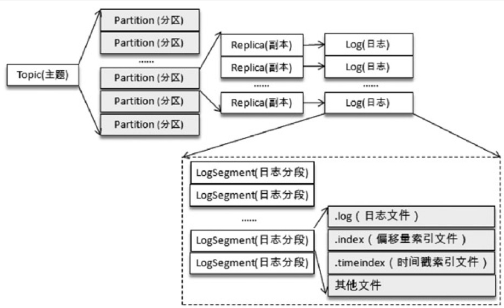
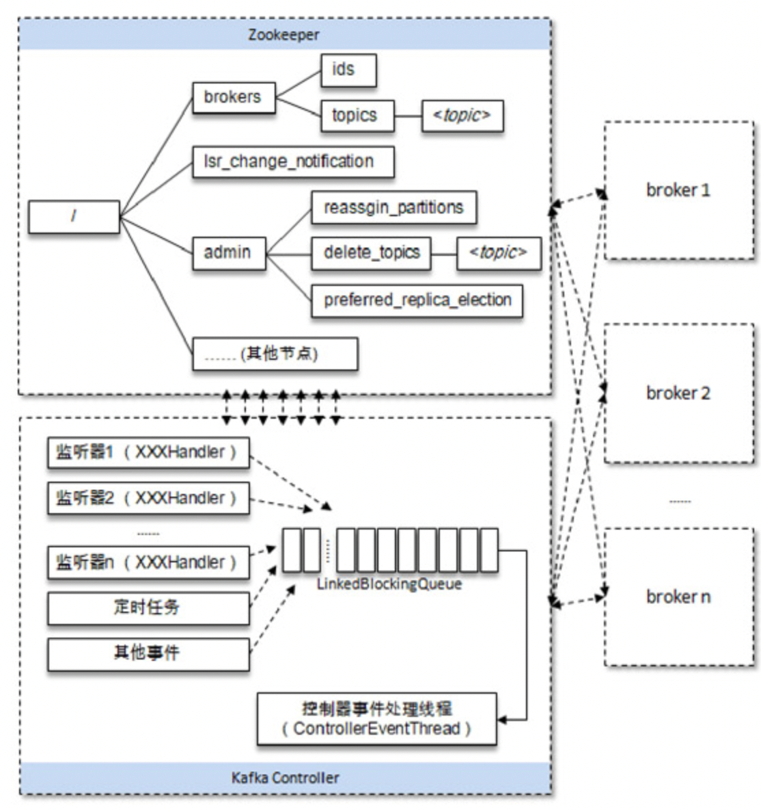
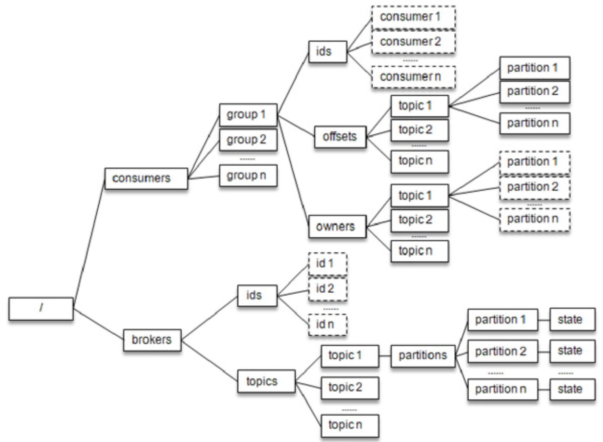
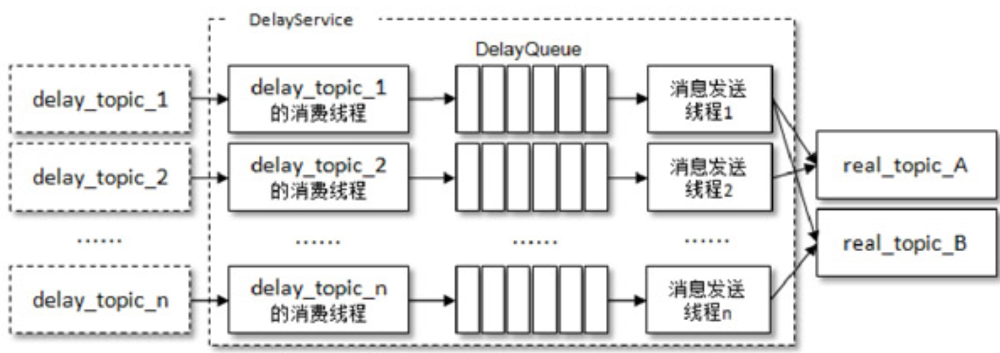
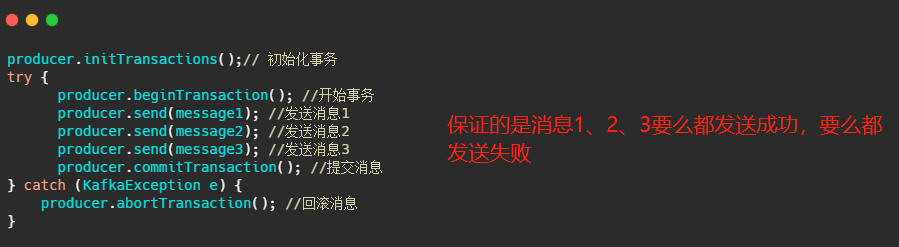

Kafka备忘

# 关键词

两种模式：
- 点对点（P2P）：生产消费一对一
- 发布订阅（Pub/Sub）：生产消费一对多广播

- producer
    - acks: 多少个ISR中的副本写入才认为消息写入成功，0 - 不需要确认， 1 - leader写入即可， all 全部副本都写入（但当ISR中只有leader时仍然可能丢消息，需要配合）。
- consumer
    - consumer group:
        - 每一个分区只能被一个消费者组的一个消费者消费
        - 可以通过增加消费者组中的消费者数量来提高并发量，但是消费者数量不能大于分区数量，否则就会有消费者分配不到任何分区
    - `__consumer_offset`
- broker
- zookeeper

- topic
- partition
- replica
    - Leader
    - AR(Assigned Replicas): 分区中的所有副本
    - ISR(In-Sync Replicas)：同步中的副本，仍然可能会有一定程度的滞后
    - OSR(Out-Sync Replicas): 滞后过多的副本

- HW: High Watermark，消费者可消费的最大消息偏移量
- LEO: Log End Offset LEO是Log End Offset的缩写，它标识当前日志文件中下一条待写入消息的offset，LEO的大小相当于当前日志分区中最后一条消息的offset值加1。分区ISR集合中的每个副本都会维护自身的LEO，而ISR集合中最小的LEO即为分区的HW，对消费者而言只能消费HW之前的消息

- 再均衡
- Broker Controller
- 墓碑消息: key不为空，但是value为空的消息


# FAQ

## 性能优秀的关键

kafka性能关键
- 顺序追加写日志文件
- 大量利用操作系统页缓存，避免实际io
- 零拷贝
- 基于tcp的二进制协议

## 日志文件结构



todo

## 消息格式


## 零拷贝

常规 `disk -> kernel cache -> user space -> socket buffer -> nic buffer`

零拷贝 `disk -> kernel cache -> nic buffer`

## Broker Controller

控制器负责监听ZooKeeper上各种事件，从而触发诸如副本Leader选举、ISR变化时通知broker更新元数据、再分区等操作。

控制器是通过broker启动时抢先注册ZooKeeper上的`/controller`节点实现的，先注册成功的节点便会成为broker controller



## ZooKeeper 节点

与消费者消费相关的节点



## 消息发送消费流程

```
producer.send() -> producer -> producer interceptor -> producer serializer 

-> consumer.poll() -> consumer deserializer -> consumer interceptor -> consume
```

## 三种消息传输保障级别

- `at most once`
- `at least once`
- `exactly once`

kafka通过幂等的方式可以保证 `exactly once`，但这个语义仅限于单producer、单分区。简单地说，producer会为每条消息生成单调递增的序列号`seq`，消费者在消费一条消息后会将消费序列号`seq_old`保存下来，下次消费时仅接受`seq_old + 1`序列号的消息，由此避免了重复消费和消息丢失。

## 如何保证消息不丢

完全处理完消息后再commit offset，不过这样可能会导致重复消费，需要保证消费的幂等性

## 如何实现延迟消息

在发送延时消息的时候并不是先投递到要发送的真实主题`real_topic`中，而是先投递到一些Kafka 内部的主题`delay_topic`中，这些内部主题对用户不可见，然后通过一个自定义的服务拉取这些内部主题中的消息，并将满足条件的消息再投递到要发送的真实的主题中，消费者所订阅的还是真实的主题。



## 如何实现死信队列

## Kafka中的事务消息？

而 Kafka 事务消息则是用在一次事务中需要发送多个消息的情况，保证多个消息之间的事务约束，即多条消息要么都发送成功，要么都发送失败，就像下面代码所演示的。



Kafka事务消息中的事务指的多个消息发送形成一个事务，并不是直觉上的「将消息发送这个步骤纳入业务事务中（具体来说就是DB事务）」，RocketMQ事务消息解决才是本地事务的执行和发消息这两个动作满足事务的约束。

# 最佳实践

## MQ消息仅作为触发事件，业务数据仍然实时读取

# ref

- [深入理解Kafka：核心设计与实践原理-朱忠华-微信读书](https://weread.qq.com/web/bookDetail/e9a32a0071848698e9a39b8)

	1-8章很好地介绍了使用方法和原理，11章介绍了一些业务开发时常见的使用技巧，挺好的一本书。


