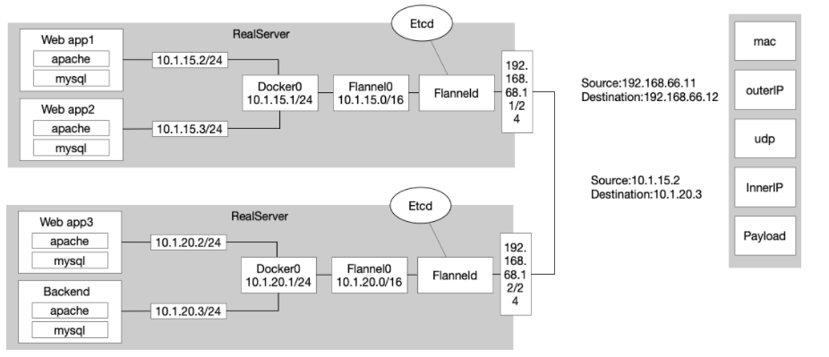
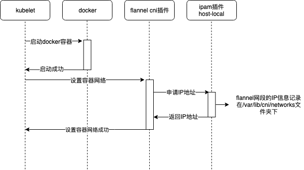
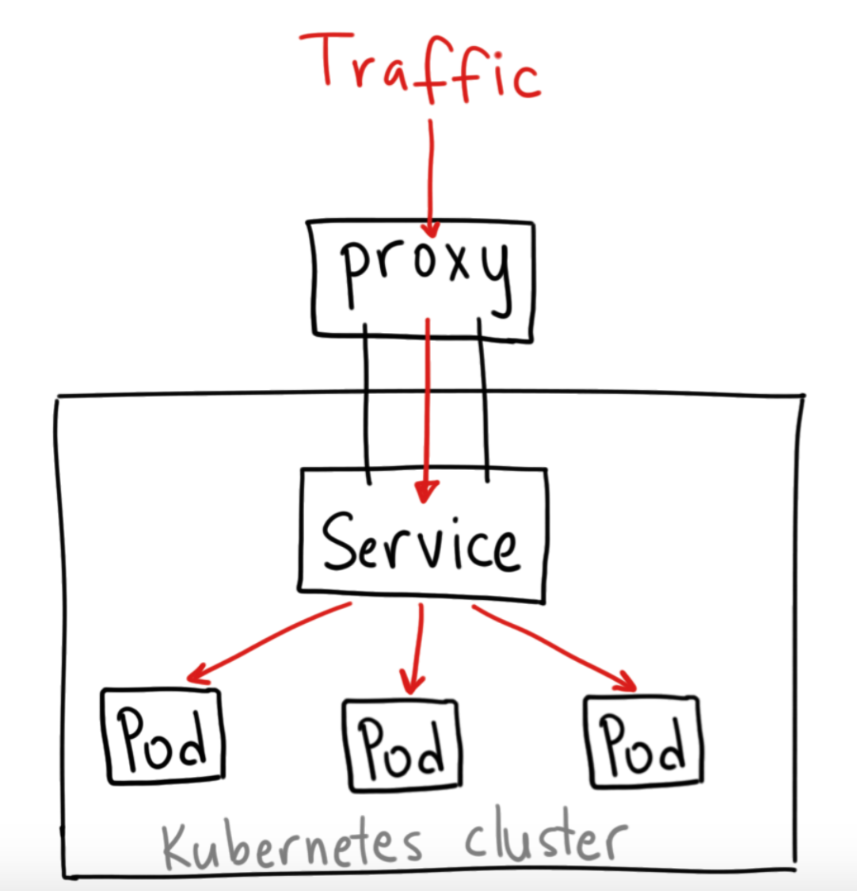
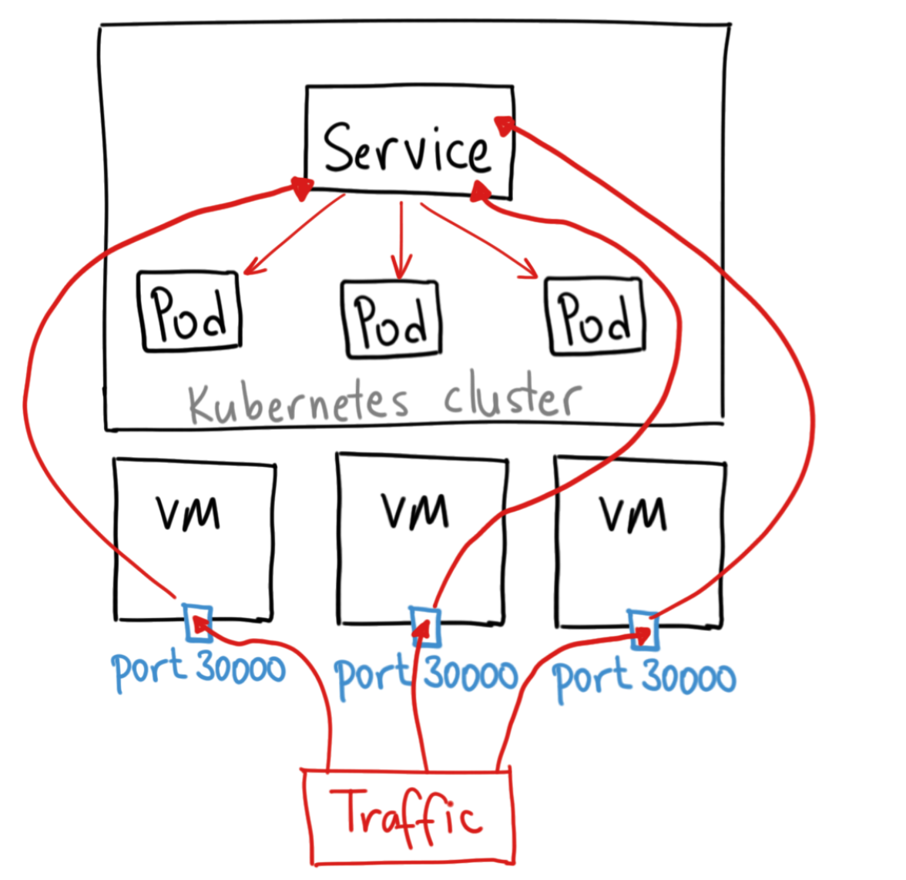
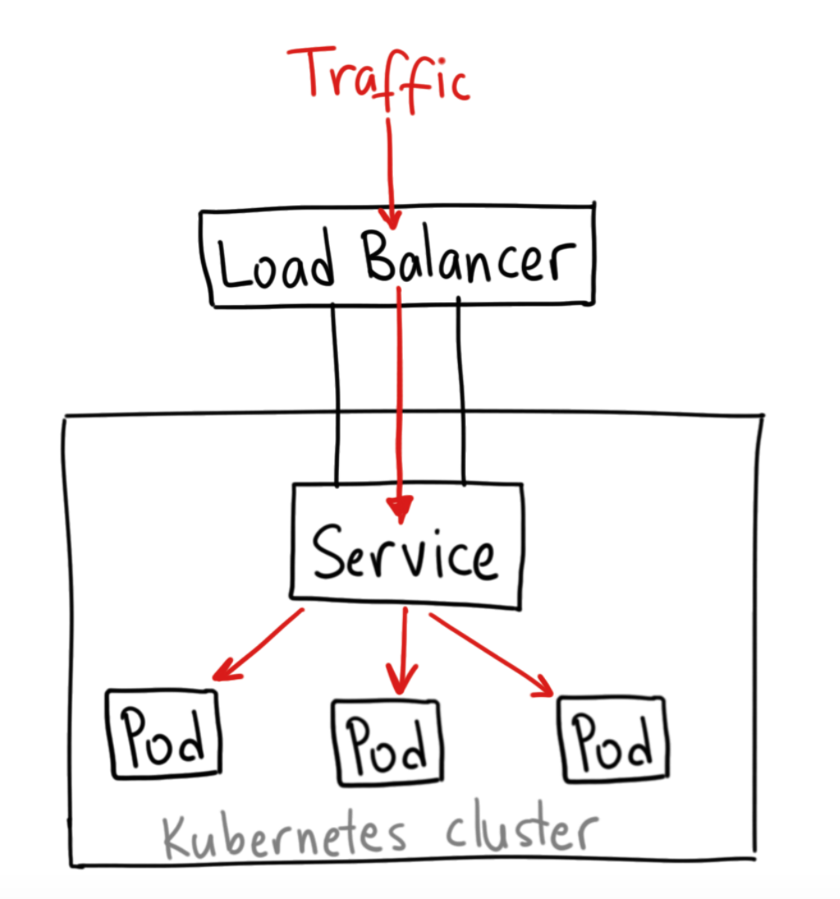

# 什么是云原生

CNCF 关于云原生给出的描述如下：

> Cloud native technologies empower organizations to build and run scalable applications in modern, dynamic environments such as public, private, and hybrid clouds. Containers, service meshes, microservices, immutable infrastructure, and declarative APIs exemplify this approach.
>
> These techniques enable loosely coupled systems that are resilient, manageable, and observable. Combined with robust automation, they allow engineers to make high-impact changes frequently and predictably with minimal toil.

简单来说，云原生是一种面向云端环境的编程与架构方式，使得系统可以组件松耦合、弹性化、自动化、自恢复、易管理、易观测、快速迭代。

实践上，通常会满足如下条件：

- 无状态、容器化
- 容器自动编排
- 微服务
- 满足云原生12要素
- DevOps
- 混沌工程

## 云原生十二要素


# Container 容器

## 资源隔离实现

- Linux Namespace
- Cgroup

> Two mechanisms make this possible. The first one, Linux Namespaces, makes sure each process sees its own personal view of the system (files, processes, network interfaces, hostname, and so on). The second one is Linux Control Groups (cgroups), which limit the amount of resources the process can consume (CPU, memory, network bandwidth, and so on).

## 容器镜像的分层
> But layers don’t only make distribution more efficient, they also help reduce the storage footprint of images. Each layer is only stored once. Two containers created from two images based on the same base layers can therefore read the same files, but if one of them writes over those files, the other one doesn’t see those changes. Therefore, even if they share files, they’re still isolated from each other. **This works because container image layers are read-only. When a container is run, a new writable layer is created on top of the layers in the image. When the process in the container writes to a file located in one of the underlying layers, a copy of the whole file is created in the top-most layer and the process writes to the copy.**


## 目前缺陷
> In theory, a container image can be run on any Linux machine running Docker, but one small caveat exists—one related to the fact that all containers running on a host use the host’s Linux kernel. If a containerized application requires a specific kernel version, it may not work on every machine. If a machine runs a different version of the Linux kernel or doesn’t have the same kernel modules available, the app can’t run on it.


# Kubernetes 概览

K8s 本质上是分布式管理系统的一种实现，即管理、协调、调度分布式资源的软件。

其最核心的理念，在于声明式（declarative）的资源管理，而非命令式(imperative)的操作。

## 架构
> At the hardware level, a Kubernetes cluster is composed of many nodes, which can be split into two types:
> - The master node, which hosts the Kubernetes Control Plane that controls and manages the whole Kubernetes system
> - Worker nodes that run the actual applications you deploy
> 


> Figure 1.9 shows the components running on these two sets of nodes.
> 

> 


### MasterNode
> The Control Plane is what controls the cluster and makes it function. It consists of multiple components that can run on a single master node or be split across multiple nodes and replicated to ensure high availability. These components are
> 

> - The Kubernetes API Server, which you and the other Control Plane components communicate with
> - The Scheduler, which schedules your apps (assigns a worker node to each deployable component of your application)
> - The Controller Manager, which performs cluster-level functions, such as replicating components, keeping track of worker nodes, handling node failures, and so on etcd, a reliable distributed data store that persistently stores the cluster configuration.


### WorkerNode
> The worker nodes are the machines that run your containerized applications. The task of running, monitoring, and providing services to your applications is done by the following components:
> - Docker, rkt, or another container runtime, which runs your containers
> - The Kubelet, which talks to the API server and manages containers on its node
> - The Kubernetes Service Proxy (kube-proxy), which load-balances network traffic between application components


## 与 K8s 交互


# Pod
> A pod is a group of one or more tightly related containers that will always run together on the same worker node and in the same Linux namespace(s).


# Controller


# Service / Ingress


# Volume


# ConfigMap / Secret


# Depolyment / StatefulSet


# 网络

Kubernetes 网络解决四方面的问题：

1. 同节点的pod通信：一个 Pod 中的容器之间通过本地回路（loopback）通信。
1. 跨节点的pod通信：集群网络在不同 Pod 之间提供通信。
1. 通过Service访问pod：通过iptables配置NAT实现
1. 集群外访问集群内Service：Service 资源允许你 向外暴露 Pod 中运行的应用， 以支持来自于集群外部的访问。Ingress 提供专门用于暴露 HTTP 应用程序、网站和 API 的额外功能。

## CNI

CNI全称`Container Networking Interface`，主要分为如下两部分：

1. CNI Plugin为容器配置网络，主要有`AddNetwork`、`DelNetwork`两个接口
2. IPAM Plugin负责给容器分配IP地址，主要实现包括`host-local`和`DHCP`

网络插件的模式也有多种，分别侧重于灵活与性能，包括：

1. Overlay模式，基于虚拟化的上层逻辑网络，好处在于它不受底层物理网络结构的约束，有更大的自由度，更好的易用性；坏处是由于额外的包头封装导致信息密度降低，额外的隧道封包解包会导致传输性能下降。典型插件为Flannel（VXLAN模式）、Calico（IPIP模式）、Weave等
1. Underlay模式，要求容器的网络接口能够直接与底层网络进行通信，因此该模式是直接依赖于虚拟化设备与底层网络能力的，性能最好。典型插件有`MACVLAN`、`SR-IOV`
1. 路由模式，属于 Underlay 模式的一种特例，这里将它单独作为一种网络实现模式来介绍。相比起 Overlay 网络，路由模式的主要区别在于它的跨主机通信是直接通过路由转发来实现的，因而无须在不同主机之间进行隧道封包。

## 网络方案

### Flannel

Flannel功能并不复杂，最主要的功能就是实现IP段的管理与分配，同时利用不同的后端技术来实现不同宿主机之间IP段的互通。Flannel要求在每个宿主机节点上部署进程。



Flannel0作为overlay网络的设备，用来进行数据报文的封包和解包。不同node之间的pod数据流量都从overlay设备以隧道的形式发送到对端。

Flanneld作为agent进程运行在每个主机上，它会为所在主机从集群的网络地址空间中，获取一个小的网段subnet，本主机内所有Pod的IP地址都将从中分配，这样就可以保证集群内各个Pod的IP是唯一的。同时Flanneld监听K8s集群的数据库etcd，为Flannel0设备提供封装数据时必要的mac、ip等网络数据信息。




### Calico

// todo

## Pod对外暴露服务的模式

### hostNetwork

这种网络模式 ，相当于 `docker run --net=host`，pod采用宿主机的网络命名空间。此时，pod的ip为node节点的ip，pod的端口需要保持不与宿主机上的port端口发生冲突。

此时pod ip和host ip相同，可以通过`hostip:port`访问。

### hostPort

hostPort模式中，pod会获得自己的pod ip，pod ip是根据docker网桥IPdo指端分配的一个ip地址。kubelet会通过配置路由表DNAT的方式将容器端口与宿主节点上的端口建立映射关系，这样用户就可以通过宿主机的ip、端口来访问pod。

可以通过`pod-ip:pod-port`或`host-ip:host-port`访问。

### service - clusterIP

ClusterIP类型的Service只能用于集群内部通信。不能用于外部通信。这种模式会给Service分配一个虚拟IP，KubeProxy修改路由表转发目标为该虚拟IP的请求从而实现了访问入口。因为该虚拟IP只能在集群内访问，故而此类service无法对外提供服务。

ClusterIP Service类型的结构如下图所示：



### service - nodePort

在Cluster IP的基础上，每一个物理节点会暴露相同的端口供外部访问，然后KubeProxy将该端口流量转发至一个类似ClusterIP的实现上，然后通过NAT的方式将流量最终转发至pod。

使用如下配置文件创建service：

```yaml
apiVersion: v1
kind: Service
metadata:
  labels:
    name: mysql
    role: service
  name: mysql-service
spec:
  ports:
    - port: 3306
      targetPort: 3306
      nodePort: 30964
  type: NodePort
  selector:
    mysql-service: "true"
```

最终node上会暴露出30964端口。当访问node上的30964端口时，其请求会转发到service对应的cluster IP的3306端口，并进一步转发到pod的3306端口。

实现方式仍然是KubeProxy修改iptables、新增DNAT。



### LoadBalancer

LoadBalancer类型的Service通常和云厂商的LB结合一起使用，用于将集群内部的服务暴露到外网，云厂商的LoadBalancer会给用户分配一个IP,之后通过该IP的流量会转发到你的Service



## 网络请求通过service访问至pod时发生了什么？

# Operator

# ref

- [自己动手写Docker (豆瓣)](https://book.douban.com/subject/27082348/)
- [Kubernetes in Action (豆瓣)](https://book.douban.com/subject/26997846/)
- Microservice Patterns (2017)
- Cloud Native Patterns (2019)
- [https://docs.microsoft.com/en-us/dotnet/architecture/cloud-native/definition](https://docs.microsoft.com/en-us/dotnet/architecture/cloud-native/definition)
- [容器网络与生态 | 凤凰架构](http://icyfenix.cn/immutable-infrastructure/network/cni.html)