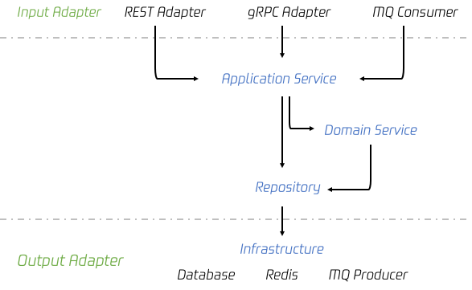

# 战略设计：限界上下文与通用语言

用微服务开发的角度（而非业务的角度）来说，就是拆解服务（判别限界上下文）。然后对服务中的实体及其行为（通用语言）进行规定，自此以后的开发过程中对使用一致的通用语言进行讨论与开发。

每个限界上下文是问题空间的一部分，随着项目进展的前进逐渐转换为一个解决方案空间，具体到开发阶段便是形成了一个微服务，用以解决一类问题。其中组织的关键战略举措便是核心域。而这个核心域，是由领域专家与软件开发人员通过不停讨论打磨得到的，是领域专家心智模型的体现。

此处关于“如何发展_通用语言_”我目前仍然不是十分明白，目前阶段我的理解是对于产品的使用场景不停的问问题：**谁**执行了什么**动作**导致了怎样的**结果**。这其实就可以对应到_行为驱动开发，_很多测试框架都支持这种开发模式。另一种类似的便是测试驱动开发。他们都是在开发初期设置好行为（测试），一开始没有开发时所有的测试均不会通过，直到系统完成通过所有的测试。

在开发形式上，每一个限界上下文形成一个源代码仓库。DDD 的关键在于维持限界上下文的独立性，不要给其他人修改你的代码的机会，而只能通过官方接口调用限界上下文。

关于上下分的边界划分，我觉得书中一个小例子很到位：

> 另一个例子：什么是飞行？航空业中的“飞行”有很多含义。其中一个是，飞机从一个机场飞到另一个机场的单次起降。飞机维修领域则有另一种不同的定义。还有一种是客票领域的定义，可以是直达也可以是中转。这几种“飞行”概念只有通过各自的上下文才能被清晰地解释，并且应该在被分离的限界上下文中建模。在同一个限界上下文中为这三种概念建模会导致混乱。

还有一个更为展开的例子：

> 你意识到不同业务领域对同一术语可能有不同的定义时，就可以肯定这种分离是必要的。考虑一下保单（ Policy）的概念，以及其在不同的保险领域中不同的含义。可以很容易地想象出，保单在承保中的含义与理赔、审核中的含义有很大的不同。

对于这些不同的表单，应当将其拆分到不同的限界上下文中，并对其中的“保单”都使用这个最简单的名字：

限界上下文在实践中又会被以如下的层次具体实现：

其中，领域模型与技术无关，除去领域模型的另外三层均为技术的具体实现。而架构模型有如下很多可供选择，他们也可以根据需要混合使用：

- 事件驱动架构
- 命令和查询职责分离（CQRS）：Command Query Responsibility Segregation 和传统的 CRUD 模式不一样，它把同一个模型的无副作用查询操作和改变状态的修改操作（通常称为命令）分开。两部分可以分别在不同的模块和服务实现，可以分别部署到不同的硬件或基础设施上，甚至可以使用完全不同的数据存储方式。例如，改变状态的命令经常会采用_事件溯源_来实现。这种架构特别适合需要高性能且查询和命令的扩展性有不同要求的应用（或者服务），它们可以根据自己的需要分别采用不同的方式进行扩展。当然，随之而来的是架构复杂性的增加，在使用之前需要谨慎地权衡， 选择合适的服务或模块应用这种架构
- 响应式架构与 Actor 模型
- REST、gRPC、graphQL：这些都是 API 的设计风格，使用前应参考成熟的 API 设计范例，例如 Github 的 RESTful API
- SOA

# 战略设计：子域

子域通常是和限界上下文一对一的。

## 子域的类型

### 核心域

它是惟一的、定义明确的领域模型，要对他进行战略投资，并且在一个明确的限界上下文中投入大量资源去精心打磨通用语言。核心域便是组织最重要的项目，是组织的核心竞争力，也是区别于其他竞争者的区别所在。

### 支撑子域

这类建模场景提倡的是“定制开发”，因为找不到现成的解决方案，对它的投入达不到与核心域相同的程度，也需会考虑使用外包的方式实现此类限界上下文。这类子域仍然十分重要，核心域的成功离不开它。

### 通用子域

通用一词指的是在市场上通用的子域，通常有成熟的解决方案，通过采购或外包的方式解决。

总的来说，子域的划分不仅涉及资源分配、实现方式，还会影响组织架构与流程。核心域是产品独特的竞争力，他是产品之所以存在的根本。因此在产品的初期，没有经过市场验证之前，我们需要遵循 MVP（Minimum Viable Product）原则快读迭代以获取市场反馈，一旦产品被市场验证可行，则需要进行合理的重构。支撑子域不需要过度地考虑可扩展性和兼容性，可重用性并非技术着力的方向，可替代性才是。这就要求我们队支撑子域有着明确的七月规范和业务约束条件，即严格接口定义。

# 战略设计：上下文策略

敏捷项目的核心域必须与其他限界上下文进行集成，这种集成关系在DDD中称为**上下文映射**（Context Mapping）。考虑到不同的限界上下文中存在不同的通用语言，那么两个团队在工作时，需要考虑如何适应对方的语言。

## 几种不同的上下文映射

### 合作关系

需要彼此的紧密合作与高度一致。

### 共享内核

两个团队共同依赖于一个小且通用的模型，一般而言，这个模型由其中一方负责维护。

### 客户-供应商

客户与供应商共同制定规划来满足预期，但是最终是由供应商决定客户获得什么与合适获得，占支配地位；只要企业文化不允许供应商完全自治或无视客户实际需求，这种关系是一种非常典型且现实的实现。

### 跟随者

跟随者关系存在于上游团队和下游团队之间，上游团队没有任何动机满足下游团队的需求。由于各种原因，下游团队也无法投入资源去翻译上游模型的通用语言来适应自己的特定需求，因此只能**顺应**上游模型。例如，当小团队接入庞大、复杂且成熟的上游系统时，往往会成为跟随者：作为亚马逊联盟的卖家在与其进行集成时就要考虑遵循 Amazon.com 的模型。

### 防腐层

防腐层（Anticorruption Layor）是最具防御性的上下文关系，下游团队在其通用语言和位于它上游的通用语言中创建了一个翻译层。防腐层**隔离**了上游模型与下游模型，并完成两者之间的翻译。

其实也就是兼容层， 客户端在接入服务端时进行额外的一层封装，将上游服务端可能产生的变化限制在这个范围内，避免上游服务的腐烂（corruption）影响到下游客户端的代码。

关于这一点可以联想到自己之前开发的天气服务，服务提供方的接口设计十分诡异。彼时不提供防腐层进行隔离造成了三个严重的后果：

1. 自己代码写着难受，受限于上游服务的格式；
1. 提供给下游也只能是同样糟糕的接口格式；
1. 没有将对方的通用语言转换为我方的通用语言，少了这层抽象，让编码过程十分被动，理解对方通用语言的成本也很高，思考负担很大。

### 开放主机服务

开放主机服务（Open Host Service）会定义一套协议或接口，让限界上下文可以被当做一组服务访问。

### 已发布语言

已发布语言就是有着丰富文档的信息交换语言，例如 XML Schema、JSON Schema 或者序列化定义（Protobuf、Avro 等）。通常同时使用开放主机服务与已发布语言为第三方提供最佳的集成体验。

### 各行其道

各行其道意味着两个限界上下文间没有关系，不需要控制，也不需要承诺。例如电商系统中，账户子域与物流子域就没有直接联系。

### 大泥球

上图左侧即为大泥球，这种系统中将所有模型杂糅在一起，难以维护，只能依赖记忆住所有问题的超人程序员才能理清细节。需要注意的是，在于此类系统进行集成时，务必创建防腐层（如上右侧子域所示），防止大泥球污染自己的模型。

## 三种上下文集成方式

- RPC
文章这里提到的是老式的 SOAP 的 RPC，缺点比较明显，在集成双方间形成了强耦合。但现代 RPC 机制改善了很多，对代码侵入少，减少了不同上下文的耦合关系。
- RESTful API
使用 REST 设计常见的错误是直接把模型的聚合形成了资源。服务端模型一旦发生变化，资源也会随之一起改变，这样会把跟随者关系强加给每个客户端。正确的实践与之相反，应当根据客户端驱动的用例设计出“合成的资源”，而不是直接给出实际的领域模型。
- 消息机制
最好的方式，可以消除同步阻塞，构建出健壮的系统，但要预见到异步系统的延迟。消息机制应当支持**至少一次**投递来保证消息送达，这也意味着消息的订阅方限界上下文必须实现为幂等接受者（Idempotent Receiver）。

# 战术设计：实体、聚合

一个实体就是一个独立的事物。每个实体都拥有一个唯一的标识符，可以将他的个体性与其他类型相同或不同的实体区分开。绝大多数时候，实体是可变的。

聚合是限界上下文的进一步细粒度划分，包含一个或多个实体与值对象，每一个聚合边界便是一个**事务边界**，即一个事务中不会操作多个聚合内的实体。每一个限界上下文的实体间可能发生相互作用。通过聚合进行战术设计便是要提取出其中最为根本的实体作为聚合根，确定实体与实体间的作用形式，划分聚合边界并完成代码设计。其中，实体与实体间通过唯一标志符进行查找、访问。

## 聚合设计的四条基本规则

### 1. 聚合边界内保护业务规则不变性（聚合编剧内多个实体的原子性）

### 2. 聚合要设计的小巧（单一职责原则）

### 3. 只能通过标识符引用其他聚合

### 4. 使用最终一致性更新其他聚合

第四点在实践过程中都是使用消息队列来实现。消息队列的好处在于消息发出者不需要关注其引起的结果，其他订阅了该事件的服务都会执行各自的对应的任务。由此，两个服务便解耦了：事件的发送者不需要负责更新其他聚合，而是由其他聚合自己处理相应的逻辑并更新自己。

## 实现

代码设计过程中有几点需要着重注意：

1. 避免贫血模型陷阱，避免传统三层模型把业务逻辑放到 Service 中的实现方法。应当使用充血模型实现更好的面向对象设计。ORM 只是 Repository 的一种实现方式，他不属于领域模型的一部分，它映射出来的对象也不应该简单地直接当做领域模型的中聚合和实体。**在设计模型时，越多的暴露 setter 也就越可能将对模型状态的改变开放给外部，而逐渐贫血化。**实际上，面向对象编程提倡的是对象的行为改变对象的状态，而非直接把状态开放给外部设置。
1. 将数据更新实时性要求高的放到同一个聚合中，避免多事务操作延时或消息机制延迟。将实时性要求低的放到不同的聚合中通过消息机制更新。
1. 适当设计、适度抽象，避免过度设计与超前设计。因为现有设计并不一定能满足未来需求，即便已经设计了，未来仍可能出现变数。还适应着重解决好当下的问题。
1. 合理封装聚合，使其易于进行单元测试。

## 如何设计聚合？

满足面向对象要求内聚要求（即“组合关系”，相互依存，整体不存在了则部分也不存在了）的对象应该构建为一个聚合，其中核心概念应该构筑为聚合根。判断是否单独拆分为聚合根更该从面向对象的角度出发，事务边界作为辅助评价标准。如果满足事务边界的要求，那其实两者已经强耦合了；如果不满足事务要求，则不见得他们之间不满足面向对象中要求的内聚。毕竟，构建聚合的目的是将对聚合的操作都限制在聚合内，避免其业务逻辑外泄。

例如，一个Project（项目）的DeliveredPkg（想用要用到的交付安装包）不能脱离Project单独存在，所以两者关系为OO中的"组合关系"，这类关系更适合放到一个聚合根里。与之对比的是Product和Project的关系，两者独立存在，互不影响，Project只是用到了某些Product，但是没有被Project用到的Product也可以存在，所以Project和Product适合拆分为两个聚合根，通过聚合根id引用。

那如果Project和DeliveredPkg拆成两个聚合会发生什么呢？实际上，刻板地严格遵循DDD的要求“聚合根与聚合根之间只能通过唯一id引用”，会导致在编程层面不便于实现面向对象编程，程序会沦为对各种零散对象的操作，例如上例中的DeliveredPkg需要维护其对应的ProjectId，这时我们必须在service层显示地调用 `DeliveredPkg#setProjectId` ，到这一步也就和普通的贫血模型加事务脚本没有区别了。

但大聚合的缺点在于其对应的repository实现会较为复杂，可以抽象相应的RepositoryFactory快速生成repository。

# 战术设计：战术设计

领域事件是一条记录，记录着在限界上下文中发生的对业务产生重要影响的事情。

要重视领域事件的命名，其用词应明确体现出模型的通用语言，并且使用动词的过去式，代表对过去发生的事情的陈述，例如 ProductCreated。而且领域实践中必须包含相应的资源标识符、对时间的描述等信息，例如下图这些事件表示：

通常，一系列的事件触发会完成一个完整的业务流程，这也就是最终一致性、柔性事务的体现，例如下图所示：

## 事件溯源

对所有发生在聚合实例上的领域事件进行持久化，把它们当做聚合实例变化的记录。使用事件溯源时，可以将聚合根据他的事件流完整的进行重建，并获得任何时刻的状态。

优点：

缺点：

// todo from book - microservice patterns

# CQRS
// todo from book - microservice patterns
一种更高层次的读写分离，同时可以显著解决事件溯源引入的查询效率问题。

优点：

缺点：

# 总结

- 限界上下文
- 子域

  通常和限界上下文是一对一的，但也会有一对多的情况，不过不建议这么建模。子域又可以分为：

   - 核心域
   - 支撑子域
   - 通用子域
  
- 聚合（每一个聚合是一个事务边界）
- 实体
- 值对象

DDD 更像是面向对象思维的超集，它将软件开发的概念从类与类的关系上上升到了服务与服务间的关系，并提出了领域事件、CQRS 等架构方法。

## 子域业务实现

每个子域（微服务）在业务实现上可以参考下图：

其中每个部分功能如下：
- `Adapter`： 外部入口，用于协议转换、参数校验等功能
- `Application Service`: 应用服务层，实现领域对象对 `Repository` 和 `Domain Service` 的调用、内外服务协同的集成逻辑等
- `Domain Service`: 领域服务层，实现核心领域业务逻辑
- `Repository`: 用于数据增删改查和权限控制
- `Infrastructure`: 基础架构层，实现具体的技术组件相关代码

从六边形架构的角度来看，领域模型位于核心，被周围的各类输入输出适配器围绕：

此外，对于 CQRS，其读写实现是不同的，因为读操作更注重批量读取满足某种条件的元素，而写操作更注重业务逻辑，故将两者拆开。让命令式编程和 DDD 都能在各自擅长的领域发挥作用。如下图：

## DDD 指导子系统设计

根据领域模型结构，我们可以去规范化以下资源的结构，降低思考负担。

- 代码模块分包
- RESTful API 设计
- 数据库设计：一个实体一张表
- Redis Key：`聚合根:id:一级实体:id:二级实体:id` 
- 消息队列 Topic：聚合根 - Topic
- 对象存储资源目录：按照聚合根实体树构建目录结构，一个目录对应一张数据表，便于后期清除垃圾数据
- 权限划分
- 微服务划分（如有必要）

## 逻辑放在Domain还是App Service

> 因为在现实业务中，很多的功能都是用例特有的（Use case specific）的，如果“盲目”的使用Domain收拢业务并不见得能带来多大的益处。相反，**这种收拢会导致Domain层的膨胀过厚**，不够纯粹，反而会影响复用性和表达能力。
> 
> 鉴于此，我最近的思考是我们应该采用**能力下沉**的策略。
> 
> 所谓的能力下沉，是指我们不强求一次就能设计出Domain的能力，也不需要强制要求把所有的业务功能都放到Domain层，而是采用实用主义的态度，即只对那些需要在多个场景中需要被复用的能力进行抽象下沉，而不需要复用的，就暂时放在App层的Use Case里就好了。
> 
> 注：Use Case是《架构整洁之道》里面的术语，简单理解就是响应一个Request的处理过程
> 
> 通过实践，**我发现这种循序渐进的能力下沉策略，应该是一种更符合实际、更敏捷的方法。因为我们承认模型不是一次性设计出来的，而是迭代演化出来的。**
> 
> 
> 作者：阿里云官网
> 链接：[https://www.zhihu.com/question/60761181/answer/874296743](https://www.zhihu.com/question/60761181/answer/874296743)

## DDD的缺点

DDD 不是万能的，其缺点也很明显。

### 产品层面的缺点

DDD 需要领域专家、产品、开发达成一个对业务模型建模的共识，即领域知识。这个建模会很大程度上影响开发的OO建模。
在互联网产品快速迭代的情况下，并没有很充裕的时间留给多方人员共同建模，更多情况是只有开发人员自己根据片面的对领域知识的理解，设计了编程上的模型；
更糟糕的是，这个建模很容易被产品迭代打破，也就会进一步导致开发伤筋动骨的重构与重写已有的模型代码。

### 技术层面的缺点

1. DDD 依赖于聚合的完整加载，避免在数据库层面执行逻辑操作。
但实际上，完全加载所有的数据到内存是不现实的，这种情况下难免需要在数据存储层面执行逻辑判断。
例如判断用户历史发帖 `post` 中被加精 `selected` 的帖子数量，用于给用户颁发精品贴勋章 `badge`，这种情况下不可能把用户的所有发帖都加载到内存里再去执行判断，一定是在数据层面进行了逻辑计算 `count(selected)`。
2. DDD `load` 聚合根很难做到比较好的性能表现：很难做到按需加载、不易完全并发加载，`JPA` 就是最典型的 DDD 实现，这些问题都难解决；
3. DDD 的 `save` 数据聚合的机制在技术上不太容易实现，很难按需更新（需要实现 `dirty check`）、不易并发 `save`（Java 的 JPA 实现中，上下文和线程绑定，无法并发实现）
4. DDD 整体更关注单一聚合实体的业务逻辑，不适用于批量操作。批量操作时仍然需要辅助使用事务脚本

## DDD 与事务脚本的折衷

所以，对于简单业务、业务模型不稳定、高速迭代的场景，还是使用比较薄的逻辑层（Logic）去操作 JavaBean 更为灵活，同时也不缺乏面向对象的特性。
这种代码写起来更像是在写面向对象的C语言（Linux 系统的风格，struct + 操作该结构体的一系列方法）。
Logic 一定是纯业务逻辑（独立于任何外部依赖，例如框架、存储等），其方法输入包含执行逻辑的必要信息，并输出期望结果。

DDD 更多的是设计、架构和建模方法，是一种看待事物的角度；而事务脚本是技术实现的方式。

对于上面帖子加精的例子，Logic 方法的输入是：

- `UserInfo` 用户信息
- `Integer` 用户加精贴数量

其返回结果是：

- `Badge` 可以颁发给用户的 badge

## DDD 聚合的适用场景

- 实体与实体关系、能力明显易区分，且逻辑较为稳定
- 客户端应用，可以加载大量信息到内存的场景
- 业务数据量不大，且对吞吐延迟不高的配置场景

## DDD 不适用的场景

- 胶水业务，只负责各个业务系统的集成与 User Case 业务逻辑

# Ref

- 《领域设计精粹》
- [后端开发实践系列——领域驱动设计(DDD)编码实践](https://insights.thoughtworks.cn/backend-development-ddd/)
- [使用DDD指导业务设计的一点思考](https://insights.thoughtworks.cn/ddd-business-design/)
- [阿里云：如何写好业务代码 - 知乎回答](https://www.zhihu.com/question/60761181/answer/874296743) 
