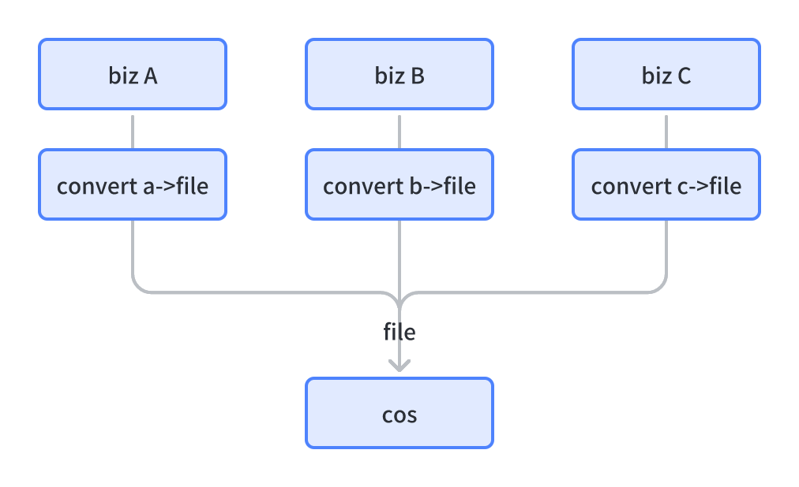

# 思维

## 没有银弹
针对场景选用合适的工具。不仅仅是编程，也包括生活。例如架构、数据库选型、开发工具、语言库等等。

不同的工具之间不一定是互斥的，例如架构设计中，领域驱动设计只是看问题的一个角度，我们也可以从传统的功能型角度去看待架构设计。最终融合领域驱动中的子域和传统功能型服务（例如网关等服务），此时这些功能型服务其实就是领域驱动设计中的支撑子域，但他并不承担领域概念，而是单纯的服务于技术目的。

不要只从一个角度看问题，这样会很局限。

## 切面编程、命令式编程
一般而言，很少有需要进行切面编程的。大多数的切面编程都是权限验证、错误处理、接口级别的缓存这种十分通用的操作，不要什么都尝试用切面编程解决，该抽象为方法的就老老实实抽象。尤其是使用 Express.js 这类切面编程友好的框架，就会不自觉地把切面编程当命令编程使用，最后代码结构混乱、不好维护。

## 依赖注入思想万分重要，是解耦的核心
对于类成员，不直接在类内进行实例化，而是通过初始化方法或 set 方法单独传入，这样可以随意组合组件，根据不同的场景使用不同的组件，大幅度解耦。在 SpringMVC 中，我们把注入的工作交给 Spring 容器，更进一步降低了开发工作量。

在 web 服务开发过程中，最重要的其实就是根据运行环境的不同注入不同的组件，例如单元测试时的 logger 为 console，但是线上运行需要变更为 FileLogger。

## 程序的本质
当然， ` 程序=数据结构+算法 ` ，但这个问题是从另外一个角度看问题，我认为 ` 程序=输入+处理+输出 ` ，尤其是对于 web 服务，也就是接收用户输入和数据库数据数据，处理后给用户输出。所以我们编程也应该从这三个基本元素去建模。通常情况下，数据库的读取和写入是在一起的，所以按照 ddd 的要求，我们将其都实现在 repository 里，而数据处理的部分使用独立的面向对象编程方法实现，纯内存实现。如果数据的读取和写入在不同的位置（例如从 MQ 读入，写入到 DB；从缓存/DB 分级读入），也可以该逻辑实现在 repository 中。repository 正如其名，就是一个数据仓库，我们的程序从里面拿出来东西，再把需要持久化的东西放进去存起来，至于如何实现 repository，业务逻辑并不关心。

Java 三层架构中的 Service 层的功能便可以简单的抽象为：处理输入参数 -> 读取数据 -> 根据业务逻辑处理（纯内存操作） -> 存储变更的数据 -> 事件发布与处理 -> 返回。多个Service功能组合可以形成更复杂的功能。抽象点看，「存储变更的数据」也可以作为事件处理的一部分，事实上，`Hibernate` 就是这么做的。
这是最简化的情况，实际开发受限于性能等因素不会这么理想化，但遵循这种思路也是能实实在在地帮助构建清晰易懂的逻辑的。甚至有些时候牺牲一些性能换去更高的可维护性、灵活性也是值的。

从更高的角度看，程序里的每一个函数、一个程序本身、一个系统，都是将输入转化成了某种输出，这种转化过程从外部看来就是个黑盒，外部用户不需要关心内不发生了什么，只需要根据其输入输出定义（接口定义）去实现自身功能即可。如果外部用户依赖了内部细节，便违背了基本的解耦理念，使得黑盒的细节不再对用户透明，这会影响黑盒内部的重构。

## 最好的语言是 Shell 和 C
在这个 Linux 作为基石的互联网时代，Shell 和 C 是最好的编程语言，且均是 Unix 默认支持的。

Shell 可以帮助我们实现很多自动化脚本，这些脚本在开发和生产环境都可以无缝的使用、可以无缝地调用 Shell 命令，可以极大降低繁复操作带来的效率损耗；后台开发的各种工作都需用到命令行，命令行便是最基本的 Shell 脚本，学会、用好 Shell 是当今时代作为开发的基本能力。虽然 Python 功能更强，在 Shell 胜在高度与系统融合且语法稳定，不会出现环境没有 Python、没有 Python3、不支持指定版本语法的各种奇奇怪怪的问题。

C 语言则是 Linux 的开发语言，Linux 的系统调用也通过 C 语言方法暴露出来。此处的学好 C 不单单是这门语言，更是背后一系列的 Linux 调用、运作原理。因为 C 是最贴近操作系统的高级语言，而其他语言也最终都只是通过 C 语言的系统调用实现自身的各种特性。所以，与其在各种高级语言的语法、库中间迷失，不如抓住其根本的 C 语言和系统接口，从底层了解系统运作。最典型的例子：学习 Java 的线程与 IO、NIO，便不如先学习 Pthreads 和 select/poll/epoll/io_uring。

## 构建「够好即可的软件」而不是「完美的软件」
如《IEEE 软件》杂志上一篇由爱德华·尤登写的文章《够好即可的软件就是最好的》所述，你能训练自己写出够好即可的软件——对用户、未来的维护者来说够好即可，只要好的程度能让你自己内心平静就可以。你会发现，你变得更有效率，用户也更快乐。而且，可能让你更开心的是，更短的孵化期促使你的程序实际上更好了。在进一步讨论之前，我们需要对将要讨论的内容做一些限定。“够好即可”这个词并不意味着草率或糟糕的代码。所有系统必须达到用户的需求才算完成，需要达到基本的性能、隐私和安全标准。你做的东西，从用户需求角度来说是否足够好？最好还是留给用户一个机会，让他们能亲自参与评判。

与构想中的明天那个完美的软件相比，今天就还不错的软件通常更讨人喜欢。如果你早点给用户一点东西玩，他们的反馈常常能引领你做出更好的最终方案（参见第 51 页的话题 12：曳光弹）。

ref: 《程序员修炼之道》

## 不要过早优化、确定瓶颈后再优化
代码在实现阶段可以考虑到初步优化（缓存、并发请求、异步），但不要具体实践，除非性能已经是明确的开发目标了。因为很可能开发完成后，一开始想到的优化点并不是系统实际运行真正的瓶颈。

优化代码需要明确瓶颈后再进行优化，避免盲目优化，吃力不讨好。

## 数据流动方式（同步、异步、阻塞、非阻塞）
这点指的是整个硬件软件体系中，系统和系统间的数据如何发生交互。其实这种流动方式体现在高级语言层面，就是 IO 的方式：

**同步、异步**

同步异步指的是 caller 和 callee 间的**消息通信机制**，也就是如何在两者间传递 callee 的返回值

- 同步方式指的是 caller 调用 callee 成功后一定能直接拿到结果，拿不到则 callee 不会返回；
- 异步指的是 A 调用 B 后不会直接拿到结果，而是等待 B 通过回调、信号等方式的通知 A 执行结果

**阻塞、非阻塞**

阻塞非阻塞指的是 caller **在等待调用结果（消息，返回值）时的状态**

- 阻塞指的是 caller 在等待调用结果时挂起，不能处理任何其他事务
- 非阻塞指的是 caller 等待调用结果时不会将自己挂起，立刻拿到返回数据（无论是否存在）后做进一步处理

需要注意的是，阻塞是操作系统级别的概念，指的是进程不再占用 CPU 时间片，对硬件并不适用。

同步非阻塞 IO 的情况下，caller 和 callee 之间传的结果是「可否进行 IO」，「同步」指的是返回结果会通过 IO 的系统调用直接返回，「非阻塞」指的是这个判断不会将当前进程挂起。

**对于CPU来说**

同步：

- X86 CPU 从 MEM 获取数据 `movl 8(%ebp), %edx` 这一指令，是同步等待内存地址位置的数据进入 edx 寄存器。该指令完成后，数据一定在 edx 寄存器中，所以是「同步」的；对于 CPU 流水线来说，因为流水线不能在这期间处理其他事务，所以此时是「阻塞」的。
- CPU 轮询（poll）网卡中的数据，检查是否有数据。如果网卡有数据，返回数据字节数；如果没有，返回 0。这个过程中，CPU 在一次询问结束后总能拿到这个字节数结果，所以是「同步」的。

异步：

- 中断：CPU 接受网卡 DMA 发来的中断，执行 Interrupt Handler 获取数据；CPU 接受键盘中断，获取键盘输入的数据。

**对于高级语言编程来说**

同步阻塞：unix 中使用 read 从 socket 读取数据，返回值便是读取到字节数，这说明该操作是「同步」的；如果没有数据可供读取，当前进程挂起，这说明该操作是「阻塞」的。
同步非阻塞：unix 中使用 read 从 O_NONBLOCK 标志的 socket 读取数据，返回值是读取到的字节数，这说明该操作是「阻塞」的；如果没有数据可供读取，直接返回 0，这个调用过程中进程不会挂起，这说明该调用是「非阻塞」的。
异步：Node.js 中调用一个异步请求方法，获取结果是通过 caller 调用时传入回调函数实现的，并且此时 caller 和 callee 是并发执行的，所以该过程是「异步」的。

**对于系统架构来说**

同步阻塞：RPC 的调用与等待返回结果
同步非阻塞：调用方创建任务后，轮询检查任务创建状态
异步：消息队列、回调接口

## Repo 自洽

理想情况下，一个项目的 Git Repo 应该是自洽的，即：Repo 本身包含原始产品需求文档、项目自身源码、开发文档、构建脚本等该工程涉及到的所有内容，最不济也应包含访问这些外部资源的外链。典型的错误：Git Repo 中只存源码，文档在第三方 Wiki，构建工具在第三方 CI 平台。

这其实也就是 GitOps 所倡导的理念，用 Git 仓库定义基础设施、定义监控、定义开发过程中需要的一切，并通过 Git 的能力将这些数据管理起来，做到 `Everything as Code`。

工作和生活的文件夹也应该如此，一个 Project 文件夹应该是该 Project 涉及到的所有内容，包括个人备忘、业务资料、代码等。

## 常用的几组概念
这些概念并不是完全对立，他们都有其各自的优缺点，要看情况决定怎么使用；有时候也需要同时使用多种方法。

- 同步、异步
- 同构、异构
- 阻塞、非阻塞
- 推、拉
- 全量、增量
- `client-side`、`server-side`
- 命令式、声明式
- 读、写、追加写：读多写少、重写轻读
- 动态数据、静态数据
- 冷数据、热数据
- 顺序、乱序
- eager / lazy
- 命令式编程、面向对象编程、函数式编程

## 技术的目的

- 高性能：副本（replication）、分片（sharding）、缓存、消息队列、一致性协议、IO 复用、零拷贝
- 容错：副本（replication）、一致性协议
- 解耦：消息队列、设计模式
- 管理复杂度、封装：面向对象编程、设计模式（编程、微服务、云原生）、容器化、容器编排系统、包管理
- 提升可观测性，快速定位异常：日志系统（Logging）、链路追踪系统（Tracing）、监控系统（Monitoring）
- 快速迭代：测试、CI / CD
- 快速开发（复用）：ORM、网络框架、日志框架、脚手架

## 解耦的核心是隔离可变性，让代码 Easy to Change，最简单好用的方法便是 **分层**

解耦的核心方法是「封装」，具体实践是使用适配器或分层等，将「变化点」和「概念」限制在封装的范围内。
在「任何可能发生变化的位置」、「不希望暴露至封装外部的概念」、「需要实现多态的位置」或「需要重用的逻辑」进行封装。

计算机领域最重要解耦方法就是 **分层封装**，例如网络的分层、硬件-操作系统-JVM-字节码、软件开发中的三层模型等等，都是下层对上层屏蔽了很多细节，只暴露有限的接口，提供了可替换的下层实现。这样的设计中，底层变化不会影响上层应用。

## Don't Repeat Yourself (DRY)

想可靠地开发软件，或让开发项目更容易理解和维护，唯一的方法是遵循下面这条被称为 DRY 的原则：在一个系统中，每一处知识都必须单一、明确、权威地表达。

DRY 的思想也不影响仅限于编码中：当代码的某个单一方面必须改变时，你是否发现自己在多个地方以多种不同的格式进行了变更？有没有同时修改代码和文档，或是同时变更数据库 Schema 和代码中相关的数据结构，亦或...？如果这类情况发生，你的代码并不满足 DRY。

## 开发前要想好如何测试代码
不一定严格追求 TDD，TDD 的最大优势也不是「测试」本身， 而是可以让开发人员在开发的过程中思考如何测试代码，进一步促成保护性变成和解耦。不易测试的代码一定不是松耦合的代码。

测试时使用三步法（given / when / then）会让测试更清晰。

## 为什么要写好代码和测试

1.  个人追求，除了此项，后面的都很功利
1.  支持需求快速开发和变更，好的代码总是 easy to change 的；好的测试让代码变更没有心理压力
1.  支持快速定位问题，快速拿出日志证据，避免扯皮浪费时间。不逃避责任，但拒绝飞来横锅
1.  接口错误异常简洁易懂，避免联调人员反复人工确认，耗散精力
1.  文档完善严谨，理由同上

## 维持一致性

维持一致性可以给个人降低极大的思维负担，也可以降低团队合作时不一致导致的消耗。一致性包括但不仅限于如下这些：

- 一致的代码风格
- 一致的代码阅读体验，即可读性
- 一致的知识归档方式
- 一致的问题解决方案
- 一致的工具集
- 一致的员工在团队里的工作方式要求
- 一致的领导模型
- 一致的业务领域认知
- 一致的欠佳的代码写法，错也要错得一致，方便统一修正

## Everything as Code (XaC)

工程编码中的每一个环节都可以作为代码仓库的一部分维护起来，包括但不仅限于：

- Infra as Code: Kubernetes / Kustomize / Flux
- Pipeline as Code
- Configuration as Code
- Document as Code
- Monitor as Code

这样做的好处有：

- 基于版本管理工具记录所有的变更信息
- 基于代码仓库的统一权限管理，新人有一个 git 权限就可以开始干活
- 将原本散落在不同平台的内容聚合到一个平台，一站式获取所有信息（代码、部署、服务发现...），由此可以避免 legacy 项目只保留了代码库，丢失了部署、配置等信息
- 核心理念的不同，XaC 是声明式（declarative）的，而非命令式（imperative）
- 文本内容的复制粘贴比 UI 容易得多
- 易全局搜索
- Review Everything

## 配置中心的优点

虽然前面提到了`Configuration as Code`，但是实际的配置即代码可能会有一些缺陷，不易解决，所以传统的配置中心仍然有存在的价值。

配置中心的关键优势主要在于如下几点：

1. 热更新配置，不需要重启服务，这是配置代码打包进代码和环境变量存储都无法实现的
2. 细粒度权限划分，虽然配置及代码倡导使用Git仓库管理权限，但有时我们需要代码开源但配置闭源，这种情况下，配置中心不可避免

其他的优势包括如下这些部分，虽然hard code，配置文件，环境变量，启动参数，数据库这些方式也能实现，但不如配置中心来的便捷易用。

- 按环境、地域、集群细粒度控制配置
- 灰度发布
- 审核、审计
- 配置监控

## 对于大部分项目，可维护性（可测试性） **远大于** 可复用性、代码优雅度，业务并没那么多可复用的东西

## 文件夹分类的思路，先领域、后属性
首先，我们应按照归属 **领域** 去分类文件，例如 `work/mi/project/moss` 说明这个文件夹表明这是 **工作** 中、**小米公司** 的 一个 **项目**，项目为 **moss**。在这个文件夹下，再进一步按照 **属性** 细分为 `doc` / `code` / `asset` / `archive` 等功能性目录。一个目录的前 N 级应始终是以领域划分的，后 M 级应该始终是以属性划分的，否则，交错划分反而会使文件夹的目的不明确，并且将同一个领域的概念打散到了多个文件夹中。

代码中也是如此，应先按照业务分类，再按照具体的技术组件分类。例如打车业务的 Java 项目中，应该先构建一级目录，例如 `user` / `taxi` 等，再根据构建二级目录例如 `controller` / `service` / `dao` / `pojo` 等根据元素属性构建的目录。

标签系统中，领域和属性应该是两个基本的标签维度。例如 `#打车 ` `#pojo`，在该基础上再去衍生更多的标签。

## 评价一个架构的维度

- 性能：响应时间、吞吐量
- 可用性：自愈能力
- 伸缩性
- 扩展性
- 安全性
- 可观测性
- 易开发&部署
- 易测试

推荐好文：[Software architecture patterns – O’Reilly](https://www.oreilly.com/content/software-architecture-patterns/)

## 学习新语言时是在学习什么？

- 语法
- 语言哲学
- 语言特性
- 标准库
- 生态

> 不能影响到你的编程思维方式的编程语言不值得去学习和使用
> - 首届图灵奖得主、著名计算机科学家Alan J. Perlis

## 一个函数只做一件事

对于大部分方法而言，一个函数只做一件事。对于全局的入口级别方法，需要提供尽可能丰富的功能，会违背该原则，但这是正常的。

## 特化方法兼容通用实现而非反过来

特化的兼容通用的，而非反过来。

例如业务逻辑biz存一个业务文件对象bizFile到对象存储cos，那cos处接口应该是cos.save(file)，biz实现适配器方法 `biz.save(bizFile){cos.save(convert2file(bizFile))}` ，这样未来如果biz有任何业务逻辑修改，只需要修改biz一个文件即可，不需要动到cos。各个其他biz只需要实现自己的`converter`即可



# 编码实践

## 开发阶段与 DevOps

- 明确需求

  输出明确的产品需求文档。

- 任务拆解

- 系统设计：方法论
  - DDD 分析
  - ER 图，即实体与实体间关系
  - 业务时序图
  - 接口文档

- 编码开发：

  输出项目代码、SQL 文件等

  - 维护项目代码模板，善用 IDE 的模板功能去整理模板代码，例如 HTTP 请求、缓存等、领域对象、建表 sql 等
  - 预留内部接口实现特定功能
  - 预留曳光弹接口，检测下游组件稳定性

- 测试

  - 单元测试：对应功能性方法进行单元测试
  - 集成测试：对业务逻辑进行集成测试，从 Controller 到 DB，mock 外部依赖
  - 接口测试：通过测试平台直接访问测试环境接口进行测试，并且可以进一步设置为拨测

- 上线：

  - 配置 CI / CD 模板
  - 配置日志上报
  - 设置监控告警

- 运维与监控：维护日志模板、预留性能指标接口、监控四大黄金指标
- 性能优化：方法论

这其中需要准备如下这些资源，注意不同环境的资源隔离：

- 部署环境：K8s Workloads
- 依赖组件：DB、MQ
- 流水线：持续集成流水线
- 服务发现注册：如果非服务自注册，则需要配置服务发现
- 日志上报：正式与测试环境共用一套即可，方便快速定位是否为访问环境错误的问题
- 监控告警

DevOps 实际上是开发监控优化的循环：


上述循环中的开发阶段对应到 DevOps 上可以细化为如下过程：


ref: https://docs.gitlab.com/ee/ci/introduction/

## 业务代码编写测试的原则

业务测试代码测试以黑盒测试为主，白盒测试为辅。

黑盒测试主要是对 API 进行 **集成测试** ，保障接口输入输出及行为满足 API 设计期望。

白盒测试主要针对核心业务逻辑或独立的工具方法进行 **单元测试** ，保证核心逻辑与基础逻辑正确性。

## 异常处理
使用统一的异常处理，切面实现，并作为兜底，保证不外泄异常到外部。

## 配置与硬编码
不要过于追求“万物皆可配置”，配置会带来额外的工作量。不易发生变动、数据量不大的部分，该硬编码就硬编码，追求可配置反而会变得更麻烦。

## 使用异步而非同步函数
console.log 就是一个典型的同步函数，同步 IO 输出是极大地影响性能的点。日志库的实现一般都是维护内存队列，定时刷盘。

## 在某些时候，约定大于配置，保持自己的编程习惯
能通过约定和习惯解决的问题不要首先依赖于配置。例如，无论什么地方，都用毫秒而非秒，对于特定的终端场景再做转换。

之所以“在某些时候的限定”，是因为“约定大于配置”本身是隐晦的，约定只适用于自己绝对熟悉的某些领域，里如果设计模式、时间单位、工具类，而不适合合作类项目。Springboot 强调约定大于配置，但其很多约定初学者无从得知，由此产生很多困惑。

Python Zen 中的一条提到 `Explicit is better than implicit` 。所以说，绝大多数情况下，程序还是应直观简洁。

## 动态语言中的类
对于动态语言开发，该抽象为类的时候仍然用类，不要随意使用未定义的数据结构。随意定义的数据就够只适用于中间过程，而非抽象实体。

## 使用包装类而非原始类型
类成员变量的类型应始终使用包装类型而非原始类型，使用原生类而非原始类型。这样可以明确地区分无值（null）和 0 值。尤其是使用 mybatis 这类 ORM 工具进行动态更新时，可以明确知道哪些字段有值需要更新，而哪些字段没有值不需要更新。

## 使用领域对象尽可能缩小上下文
大型项目编写业务逻辑困难，代码散乱的一大原因在于口口相传，一旦传授的“知识”有丢失，那么后来的程序员很容易另起炉灶，把已有的逻辑又实现了一遍。最典型的情况就是枚举量都堆在一个叫 `constant` 的文件里。实际上，枚举量是最和领域对象强相关的常量，他们应当和领域对象绑定在一起，从代码实现的角度来看，他们应当是领域对象类的静态成员常量。

传统的三层架构把业务员逻辑写在 service，把常量写在统一的 constant 里，把模型 schema 写在 model 下，这就导致了一种现象：明明聚合的业务概念，被打散到三个不同的文件中。

缩小上下文后，我们将所有的枚举值、业务逻辑都挂在 model 上，这样围绕 model 构建统一的业务概念，将代码的上下文缩小到这个 model 对象上，开发人员需要的任何变量、常量都可以在一个地方找到，相比去翻多个文件来说，心智负担会极大的缩小。

## 复杂的领域对象应该是自解释的

领域对象应当包含一个元信息描述符，可以对每个成员字段进行解释，包括但不仅限于如下信息（以状态字段 `status` 为例）：

- 字段 `status`: `NORMAL` / `HIDDEN` / `DELETED`
- 字段值含义 `statusDesc`: ` 正常 ` / ` 已隐藏 ` / ` 已删除 `
- 字段注释，包含对字段的解释即描述 ` 对象状态 `

在 Java 中，一个类的描述信息可以通过注解标注在字段上，并且通过辅助工具转化为 `Map<String, String>` 表示字段名与字段注释的对应关系

上述描述符可以用于校验（`validate`）领域对象。

**上下文零散的一个例子：**

我们想要编写一个 project 的 CRUD，它有一些需要判断的逻辑，例如： ` 项目状态 ` 为 ` 正常 ` 的时候才可以修改，我们很容易写出这样的代码：
```javascript
// constant.js
const PROJECT_STATUS = {NORMAL: 0, BANNED: 1, DELETED: 2}    // 项目状态标记

// projectService.js
const deleteProject = function(projectId){
    // ... load project from db
  if (project.status === constant.PROJECT_STATUS.NORMAL){
      project.status = PROJECT_STATUS.DELETED;
  }
  // .. save project to db;
}

// project.js
class Project{
    status;
}
```

上文实现方案有两个问题：

1.  文件散落在 constant.js / service.js / project.js 三个文件
1.  project 的内部状态 NORMAL 暴露到了 service 中，而实际的调用者不应感知到这个常量，而是直接获得“正常”与否这个布尔值的结果

上文代码修改以后可以将所有的量归于 project.js 一个文件，并将同样将业务逻辑收束：
```javascript
// project.js
class Project{
  status;

  static STATUS = {NORMAL: 0, BANNED: 1, DELETED: 2};    // 项目状态标记

  isNormal(){
    return this.status === Project.STATUS.NORMAL;
  }
}
```

其实这也就是 OO 所强调的封装，但是在事务脚本大行其道的时代，似乎都被抛弃了。最明显的地方在于，将 `NORMAL` 这个概念封装，如果未来我们需要扩展一个“试用”的状态，这个状态仍然是正常的，但属于另外一个状态了。我们只需要修改 `isNormal` 方法。但对于事务脚本，我们需要注意修改所有使用了类似的语义地方。

## 使用四层（五层）模型或六边形模型而非三层模型

- 四层模型：
  - Controller：参数提取、校验、返回结构组装
  - Service：本服务用例逻辑、外部服务（通知、订单等）与服务间的协调调用、repo 的数据加载与保存、事件发布
    - **Logic：static 的核心业务逻辑、数据变化、事件生成，仅由 Service 调用，输入所有的业务必需信息，输出变更的领域对象**
  - **[ Repo ]：可选，组装不同 DAO 读取的数据实体**
  - Dao：原始的数据输入组件
- 六边形架构：领域对象位于中心，周围是 `Input / Output Adapter`，所有除了领域核心逻辑的部分都是在「适配」外部输入、输出，如下图：

  

其核心要义在于，Logic 或者领域对象，一定可以独立于框架（Spring 等）存在，并且可以独立的进行测试。四层模型也是六边形架构的一种特例，可以看做只包含一个输出适配器（转换成 controller 可用的 VO）和一个输入适配器（转换成 dao 可用的 PO）的六边形架构。
注意区分一个业务逻辑中的用例逻辑与领域对象逻辑，避免领域对象逻辑包含了太多的用例逻辑。

对应测试三步法，业务逻辑处理也可以分为典型几步骤：
1. validate: 校验入参，一般在controller里做
2. load: 加载业务所需的所有数据
3. process: 通过load的数据进行业务逻辑，过程中不再对外产生任何依赖，纯内存逻辑
4. save: 更新process过程中变更过的数据

上述情况比较理想化，但每一个业务代码块应该尽可能维持此类结构。

不同与上述思想，使用函数式编程：通过数据管道操作同一个对象，此时需要保证每一个管道组成部分都可以独立运作并测试。

## 多源对象需要使用仓库（Repository）封装为领域对象

在从多个数据源读取对象的数据时，需要使用 repository 来封装这些与数据源交互的细节，我们常用的访问 db 的 dao 应该是 repository 的一个组件，与 dao 相似的是，redis 读取的逻辑也应该封装到 repository 中。

例如，实现一个拉取文章列表 `listArticle` 的逻辑，每个文章除了自身信息存储在 db 中外，还有点赞等信息存储在 redis 中，此时我们将 `articleDao.listById` 和 `articleRedisUtil.loadLikeNum` 读取点赞数的逻辑封装在  `articleRepo` 的子方法中，一是方便在通过不同方式（例如 `loadById` 等等）读取文章时能复用读取点赞的逻辑，二是屏蔽了对象底层的存储细节，避免  `infrastructure` 的概念泄漏到 `service` 层中。

同理，理想情况下，如果领域模型需要发布事件，发布的逻辑同样应当包含在 `articleRepo` 中，模型做的事情就是单纯的把 `event` 存储到自身的 `events` 字段中。
但实践中，多数情况下并不需要这么严格的抽象，逻辑上等价即可。

需要强调的是，repo 不应该按照 DDD 的理想情况去极端地仅实现 `load()` 和 `save()` 两个方法。由于 save 是以聚合根为单位的，这样实现会产生严重的性能问题。实践中可以根据不同的情况实现不同的 `load()`，并增加一个 `update(obj, diff)` 用于增量更新领域对象某些字段，一般都需要相关的 `dirty-check` 逻辑辅助。

Repository 正如其名，其本质是领域对象的仓库，是领域对象和基础设置之间的桥梁。

## 曳光弹模式

对于复杂的业务逻辑实现，例如访问 A 服务后、再访问 B 服务、再访问 DB，先实现一系列小代码保证 A、B、DB 都是可以成功访问的，再实现具体的整合逻辑。

## 不可靠时钟

时钟有两种：时钟和单调钟。前者适用于获取当前绝对时间，后者适用于衡量时间流逝。

通常我们使用的 `System.currentTimeMillis()` 是本机的系统时钟，有可能因为 `NTP(The Network Time Protocol)` 发生时间回退的问题，导致不可靠的分布式系统异常，例如「最后写入为准」中的时间戳实际上并非分布式系统中全局一致的时间戳。与之相对的， `System.nanoTime` 是「单调钟」，他的绝对值没有意义，但其保证了自增的性质，使用与时间长度的计算，例如请求耗时、计算耗时。

分布式系统中，不同机器的时间戳并不一致，这也是导致分布式系统中判断时间先后最大的问题。

## 领域对象需实现 Java Bean 规范的 getter、setter、无参构造器、equals、hashCode

虽然完全暴露 getter 和 setter 对于领域对象而言是「错误」的，但是这 getter / setter 是整个 Java 生态都遵循的的 Java Bean 规范，为了保证各种组件（JSON、ORM 等）都能正常完整的访问到对象，还是要注意完全实现所有的 getter / setter。

举个例子：未实现完整 getter / setter 时，通过 Jackson 序列化后缓存到 redis 中，可能导致序列化字段不完整，进一步导致返回的反序列化数据不完整。

领域对象不直接暴露到接口，应当构建独立的 `VO` 对象，通过 `VO.of(T domaonObject)` 将领域对象转化为 `VO`，再通过 `VO` 对象给接口层面暴露数据。现实中如果没有必须要隐藏的字段，一般可以直接用同一个Class表示领域对象和VO，但一旦有区别，则应该严格拆分。

## Hibernate 和 MyBatis 的理念区别

Hibernate 以 Java 对象为核心，数据库只是用来持久化数据的存储空间而已，一般使用充血模型。

MyBatis 以数据库表为核心，Java 对象只是承载数据的 POJO，一般是典型的贫血模型。

## 随机延迟的应用

几个例子：

- 在网络请求重试中加入随机延迟抖动可以避免原本失败的请求又在同一时间到达被调方，从而引起第二次失败；同理，第二次失败和该时间段内的正常请求的失败会进一步产生第三次重试失败。进一步导致失败请求越来越来越多，产生重试风暴，拖垮服务。

- 主调方有固定时间的定时任务，每到这个时间点便会发起大量拉取数据的任务。如果此时主调方过多，被调方需要处理比平时大数倍的请求，这种请求量可能会直接导致被调服务崩溃，此时主调方应加入随机延迟，使得不同主调实例的定时任务可以错开执行时间。

- 缓存雪崩：缓存中的大量缓存 key 同时失效，使得改时间点应该读缓存的数据全部直接打到了数据库上，导致数据库查询量飙升，直接崩溃。此时应该在缓存的过期时间上引入延迟（可以直接使用缓存有效时间），使得缓存在一段时间内逐渐失效，避免缓存雪崩。

## 如何计算工期？

计算工期要区分不同的功能类型，对于不同的功能有不同的实现时间要求，将其相加后再留适度的 buffer 即可。越大的项目，排期越不准，应当向产品明确出来这种风险。如下是几种常见情况，仅供参考：

- 无现有数据结构情况下，每四个领域模型与库表设计，1 天
- 新项目环境搭建，1 天
- DB-based CRUD 开发
  - 增删改查接口开发，1 天
  - 测试，1 天
- 外部稳定系统对接
  - 熟悉系统，1 天
  - 每 2 个接口，1 天
  - 涉及到外部人员的联调，每 2 个接口 1 天（时间不确定，有风险）
- 前后端联调，每 4 个基本接口，1 天
- 联调和测试阶段要占用 0.5 的时间，虽然开发已经完成，但是需要排查问题、修改 bug

> 有一件关于估算的有趣的事——你使用的单位会对结果的解释产生影响。如果你说某件事需要 130 个工作日完成，那么听的人往往觉得实际要的时间会很接近这个数字。然而，如果你说的是“哦，大约 6 个月吧”，他们就会认为还需要 5 到 7 个月不等。两个数字表示的时间周期是一致的，但是“130 天”却可能暗示了比你想象得更高的精度级别。
>
> (美）David Thomas（大卫·托马斯），Andrew  Hunt（安德鲁·亨特）. 程序员修炼之道：通向务实的最高境界（第 2 版） (Chinese Edition) (Kindle 位置 1540-1544). Kindle 版本.

注意！工期不等于排期，排期要明确开始结束时间点，但因为需求累积很多，短工期任务不一定能立刻完成，而是要等前序需求开发完成后才能启动。这时候可以跟产品同学说“工期是3天，但目前手上需求很多，没有排期了”，如果是对外项目，不要给外部人员直接报工期和排期，要等待己方项目和产品沟通清楚再给，可以说“目前给不出来，因为手上还有一些事情要处理，可以会后看下”

## API 开发

接口开发应当要自底向上思考，自顶向下开发。

自底向上思考指的是考虑这个接口本质上哪些部分属于领域对象的能力、哪些部分属于服务层集成的外部能力，将不同能力划分清楚。对应到编码上，其实是最先思考 `logic` 的实现

自顶向下开发指的是先实现接口定义，再利用 IDE 自动补全与填充的能力把从上至下的层级方法一层层补全，例如先实现 `controller`，然后利用 IDE 补全 `service` / `dao`。`logic` 如前文所讲，属于核心业务逻辑，应该优先与细节（细节的定义参考 Bob 大叔的「整洁架构」一书）实现

## 不要一种 UI 形式一个接口，区分 **用例** 与 **逻辑**

不要为了一种特定的用例开发接口，而是提供基础的接口供前端调用，或者使用聚合接口完成特殊用例的流程，但聚合接口的下层业务实现还应当是基础接口。
基础接口和聚合接口应当有明显的区分，例如基础接口 `/program/update` 和聚合接口 `/biz/program/update`。

基础接口对应的实际上是基础 **逻辑**，基础逻辑产生事件。

举一个例子：当用户点击添加商品 A 到购物车后自动添加赠品 B 到购物车。这其实是一个用例，其中逻辑指的是「购物车添加商品 A」。商品 A 和赠品 B 添加到购物车应生成两个独立事件，即「购物车添加商品 A」、「购物车添加赠品 B」。

本质上讲，架构清晰是要隔离表现层、逻辑层、模型层，保持清晰的层级边界。

读接口可以相对灵活，但写接口一定要将逻辑剥离清楚并划分边界。

## Let it crash

对于非预期的代码异常，简单崩溃即可。只要有全局异常进行缺省异常处理，那内部异常没有必要时时刻刻都要捕获并处理，这会产生大量冗余代码。

不过要记得对非预期异常进行告警已提醒开发人员。

## URL 规范命名

```
┌────────────────────────────────────────────────────────────────────────────────────────────────┐
│                                              href                                              │
├──────────┬──┬─────────────────────┬────────────────────────┬───────────────────────────┬───────┤
│ protocol │  │        auth         │          host          │           path            │ hash  │
│          │  │                     ├─────────────────┬──────┼──────────┬────────────────┤       │
│          │  │                     │    hostname     │ port │ pathname │     search     │       │
│          │  │                     │                 │      │          ├─┬──────────────┤       │
│          │  │                     │                 │      │          │ │    query     │       │
"  https:   //    user   :   pass   @ sub.example.com : 8080   /p/a/t/h  ?  query=string   #hash "
│          │  │          │          │    hostname     │ port │          │                │       │
│          │  │          │          ├─────────────────┴──────┤          │                │       │
│ protocol │  │ username │ password │          host          │          │                │       │
├──────────┴──┼──────────┴──────────┼────────────────────────┤          │                │       │
│   origin    │                     │         origin         │ pathname │     search     │ hash  │
├─────────────┴─────────────────────┴────────────────────────┴──────────┴────────────────┴───────┤
│                                              href                                              │
└────────────────────────────────────────────────────────────────────────────────────────────────┘
(All spaces in the "" line should be ignored. They are purely for formatting.)
```

ref: https://nodejs.org/api/url.html#url_url_strings_and_url_objects

## 什么时候需要接口？

1. 一种抽象，多种实现
2. 对外屏蔽内部复杂度，接口简单但实现复杂，例如Facade

## 常用延迟数值 Latency Number

```
Latency Comparison Numbers (~2012)
----------------------------------
L1 cache reference                           0.5 ns
Branch mispredict                            5   ns
L2 cache reference                           7   ns                      14x L1 cache
Mutex lock/unlock                           25   ns
Main memory reference                      100   ns                      20x L2 cache, 200x L1 cache
Compress 1K bytes with Zippy             3,000   ns        3 us
Send 1K bytes over 1 Gbps network       10,000   ns       10 us
Read 4K randomly from SSD*             150,000   ns      150 us          ~1GB/sec SSD
Read 1 MB sequentially from memory     250,000   ns      250 us
Round trip within same datacenter      500,000   ns      500 us
Read 1 MB sequentially from SSD*     1,000,000   ns    1,000 us    1 ms  ~1GB/sec SSD, 4X memory
Disk seek                           10,000,000   ns   10,000 us   10 ms  20x datacenter roundtrip
Read 1 MB sequentially from disk    20,000,000   ns   20,000 us   20 ms  80x memory, 20X SSD
Send packet CA->Netherlands->CA    150,000,000   ns  150,000 us  150 ms

Notes
-----
1 ns = 10^-9 seconds
1 us = 10^-6 seconds = 1,000 ns
1 ms = 10^-3 seconds = 1,000 us = 1,000,000 ns

Credit
------
By Jeff Dean:               http://research.google.com/people/jeff/
Originally by Peter Norvig: http://norvig.com/21-days.html#answers

Contributions
-------------
'Humanized' comparison:  https://gist.github.com/hellerbarde/2843375
Visual comparison chart: http://i.imgur.com/k0t1e.png
```

## 乐观锁、悲观锁

乐观锁假设争用发生的可能性比较小，所以会先执行完操作后，直至最终提交时采取检查是否有争用。
这样的好处是避免了额外的加锁开销，但一旦发生争用，则所有的操作都白费了，并且存在ABA问题。
常见的方式是维护一个记录的版本号，如果提交时发生版本号变化，则认为发生争用并放弃本次写入，如果无变化则说明无争用可以写入。常用的乐观锁有CAS和数据库乐观锁。

悲观锁假设争用发生的可能性很大，所以会先加锁再执行操作。

## 学习新知识是渐进性的过程

以学习k8s为例

1. 使用：使用kubectl和yaml文件配置一个deployments出来。不知道怎么用就去看源码没有任何意义
1. 根据手册从源码部署一个k8s
1. 抓住**主要矛盾**、了解各种业务case的主要逻辑：了解这个创建deployments过程中发生了什么事情，例如写入数据到ETCD、API Server通知、kubelet拉起业务容器、Readiness检查通过后容器状态置位running；将其绘制成流程图、架构图会更好地帮助理解
1. 探究**次要矛盾**，了解支撑运行的周边逻辑：例如ETCD是什么、API Server和其他组件的通信机制、Readiness检查的实现、如何扩展新的CRD等引申话题

## 用好命令行工具

- xargs
- printf
- jq
- pbcopy / pbpaste
- wc
- cat
- grep

## MQ消息不携带数据快照，只携带id

理想情况下，从设计的角度考虑，因为MQ消息存在乱序的可能性，不宜直接在MQ消息中存储信息用于业务逻辑，而应该仅存储id信息，在通过id到业务系统反查获取该id获取的最新数据用于后续业务逻辑。

举个例子，如果消息A、B分别表达了文档内容更新为text_a、text_b，则搜索系统中最终数据应为text_b。
在MQ包含业务数据的设计中，消息乱序会导致数据先变为text_b，再变为text_a，这导致最终结果错误。
但如果每次仅通过文档id反差文档内容，无论是否乱序，最终获得的都是text_a。

# 模板

大部分模板应当使用 IDE 的模板功能、GitHub Gist、模板工程等方式维护，此处的模板只是索引。

## 要形成自己的开发方法论，思维模板
形成自己的开发方法论，可以大幅度降低开发耗费的时间和精力。方法论应包括但不仅限于如下方面：

1.  代码
   1.  基础 CRUD 及其关联资源 CRUD 快速实现，基于 DDD 思想
   1.  形成自己的一套模板代码
      1.  开源工具库
      1.  封装工具类的思维（不一定要有模板，但要有基本的封装方法论）
   3.  变量命名规范，例如：
      1.  事件名
         1.  onIngressCreatedEvent
      2.  类名
      2.  局部变量名
         1.  __s：表示列表(list)值
         1.  __Map
         1.  __Req
         1.  __Rsp
         1.  __Buffer
         1.  __Time 毫秒级时间戳
         1.  __Total 总量
         1.  __AccuTotal 累积量
         1.  __Avg 平均值
      4.  常量名
         1.  CONST_VALUE_LIST
      5.  数据库字段
         1.  createdBy
         1.  updatedBy
         1.  createdTime - 毫秒级时间戳
         1.  updatedTime - 毫秒级时间戳
         1.  __Date - 整型日期，例如 `20200101`
      6. 方法名
         1. Parse__
         1. Is__
         1. As__
         1. Get__
         1. Load__
         1. Create__
         1. Upsert__
         1. Delete__
2.  RESTful API 规范与习惯
2.  Project Layout / Readme Template
2.  微服务构建
   1.  基于 DDD 的领域分割方法（核心子域、通用子域、支撑子域）：一个同样的单词出现在了同一个场景下，但是表达了两个含义，应当考虑拆分为两个子域
   1.  聚合划分：理想情况下，一次事务只更新一个聚合根。实际编码中，可以接受 3 个以内的聚合根更新
   1.  事件机制
5.  架构设计思路
   1.  熟悉常见的系统方案实现，例如用户系统、权限系统、IM 系统等

## 做一个功能的顺序与思考

1.  从产品维度问问题：这个功能的使用对象、操作流程、期望结果，这是不是真实的需求？真实的需求是什么？
1.  识别实体与实体间关系：这个功能对应的操作对象是什么？对应 DDD 的聚合根是什么，对应的实体是什么？实体间关系是怎样的？
1.  对操作对象的操作（e.g. CRUD）都有哪些？
1.  这个功能是否有副作用？是否对其他系统有依赖？
1.  决定开发采用 DDD 还是 事务脚本，一般情况下混合方案，不要太死板
1.  根据 RESTful API 规范设计接口，结构上与 DDD 维持一致
1.  拆解任务，列出所有需要实现的点，将其设置为当前需求的子需求，一一实现；如果是已有实现的调整，最好在所有需求修改的位置留下 `todo` 标记
1.  编写业务逻辑
1.  编写单元测试

## System Design

1.  描述用户使用场景、限制条件和前提假设
   1.  目标用户
   1.  使用方式
   1.  各种量级：用户量级（C10K...）、数据量（存储系统选型）、QPS
   1.  系统输入、输出与操作分别是什么
   1.  读写比例：重写轻读系统 or 重读轻写？
   1.  实时性要求？
2.  简单画一下系统架构图与关键组件，描绘数据流向
2.  设计并编码技术细节
2.  优化与 Scalability：缓存、读写分离、数据库分片、负载均衡、水平扩容等

ref: [https://github.com/donnemartin/system-design-primer#how-to-approach-a-system-design-interview-question](https://github.com/donnemartin/system-design-primer#how-to-approach-a-system-design-interview-question)

## 后台项目目录

参考 `springboot-template` 项目

## 后台项目 README 目录

参考 `springboot-template` 项目

参考： [RichardLitt/standard-readme](https://github.com/RichardLitt/standard-readme)

## 业务接口文档 API Doc 目录

参考 `springboot-template` 项目

# 规范

## 命名规范
业务、项目、代码根据如下这个顺序来命名字段，降低思考负担。

- 环境：例如 prod / gray / test
- 业务：例如 blog / shop
- 服务类型：例如 server / gw / fe，分别代表后端服务、网关（接入层）、前端服务
- 子域：例如 article / feed / user
- 聚合根 / 实体：例如 timeline
- 属性：例如 id / type / status / isDelete / createBy
- 方法名：`<动词><对象><状语>`
- 数据库字段
    - 实例名：与业务名相同
    - 表名：与聚合根相同
    - 列名：与属性名相同

由此很容易定位一个对象所属的语境，例如 blog_prod_server.article.timeline.status
如果大语境下已经包含了其中某些字段，则**务必**要省略这些部分，避免冗余。

不同系统间的核心命名尽可能保持一致，例如包含了前后端服务的单体 Git 仓库名为 `blog` ，则前后端服务在 K8s workloads 命名分别为 `fe-blog` / `server-blog` ，后台服务日志主题命名为 `server-blog` ，这样可以避免不同系统间不一致的命名引发记忆负担。

与此保持一致的命名还应有开发阶段涉及到各个方面，例如浏览器收藏夹、密码管理工具文件夹、文件系统文件夹。

## 表主键使用 ` 表名+id`

例如，project 表使用 `project_id` 作为主键，而非直接使用 `id` ，这样更清晰。相关讨论见 [StackOverFlow - Is it better to name the primary key column id or *_id?](https://stackoverflow.com/questions/6469730/is-it-better-to-name-the-primary-key-column-id-or-id)

中间关联表的主键可以使用 `id`，因为该字段无实意。

2023年回头再看，感觉直接用`id`更合适，带上表前缀反而太冗余了，试想是`project.Id`清晰还是`project.projectId`清晰？

## 代码分段与排版规范

```java
public class MetaData {

    // -------------------------------------------------
    // static fields
    // -------------------------------------------------
    
    // -------------------------------------------------
    // instance fields
    // -------------------------------------------------

    // -------------------------------------------------
    // Enum / Inner Class 
    // -------------------------------------------------

    // -------------------------------------------------
    // static methods
    // -------------------------------------------------
    
    // -------------------------------------------------
    // public methods
    // -------------------------------------------------

    // -------------------------------------------------
    // protected / private methods
    // -------------------------------------------------
    
    // -------------------------------------------------
    // getters / setters / equals / hashCode
    // 用lombok简化
    // -------------------------------------------------
    
}
```

## Git commit 规范
主要参考 [angular - Commit Message Guidelines](https://github.com/angular/angular/blob/master/CONTRIBUTING.md#commit) ，但精简如下，内容全小写：
```
<type>(<scope>): <short summary>
  │       │             │
  │       │             └─⫸ Summary in present tense
  │       │
  │       └─⫸ Commit Scope: 相关业务，一般为DDD中的Domain，可选
  │
  └─⫸ Commit Type: 参考下文列表
```
其中 `type` 包含但不仅限于下：

- **feat**: 新需求开发
- **optimize**: 需求优化
- **fix**: bug 修复
- **config**: 配置项调整
- **doc**: 文档更新
- **build**: 构建相关文件调整，例如 CI 配置、构建脚本调整、dockerfile 调整
- **optimize**: 代码优化
- **perf**: 性能优化
- **refactor**: 代码重构，非产品需求和 bug 修复
- **test**: 添加或调整测试

## 日志规范
日志打印的基本内容应包括：时间、env、traceId、线程、日志级别、logger、业务标识（用户 id 等）。

对于请求日志，需要额外打印如下信息：
- caller: 主调方
- callee: 被调方
- path: 访问路径
- response: 原始返回体
- cost: 请求耗时
- status: 返回的业务状态码
- isTimeout: 是否超时

需要注意如下的关键点：

- 打日志前思考下这行日志是不是真的对排查问题会有帮助，是否完全包含了足够的信息，不要打无意义的日志
- 描述性内容全小写，除了用于精准表达代码、类、方法名等情况
- 对于自己业务代码，按需打印方法入参、方法返回值、中间 debug 信息
- 对于外部服务调用，一定在调用前后分别打印请求参数、原始返回体、请求耗时
- 对于异常，一定要打印完整堆栈信息，如果需要包装异常，一定要打印 log 原始的错误
- 配置加载前后一定要打印日志
- 定时任务执行前后一定要打印日志
- 积累一套自己熟悉的关键词： `call` / `done call` / `request xxx, req: {}` / `done request xxx, rsp: {}, cost: 123ms` / `error when xxx` / `using` / `metrics` / `audit` / `access` / `response`
- access 日志维持特定格式，方便后期解析分析与统计。例如：统计近七天访问下游某服务的平均耗时与超时比例
- 预留 API 动态调整日志级别
- 对于 Java 框架中的日志，记得补充线程池调用缺少的 MDC 信息，log4j2 可以直接配置 `isThreadContextMapInheritable=true` 属性，例如：
```java
final Map<String, String> mainMdcContext = MDC.getCopyOfContextMap();    // org.slf4j.MDC
try {
    Future<Object> t1 = networkIoExecutor.submit(() -> {
        MDC.setContextMap(mainMdcContext);
        // biz logic here ...
        return null;
    });
    Future<Object> t2 = networkIoExecutor.submit(() -> {
        MDC.setContextMap(mainMdcContext);
        // Biz logic here ...
        return null;
    });

    t1.get(5, TimeUnit.SECONDS);
    t2.get(5, TimeUnit.SECONDS);
} catch (Exception e){
    LOGGER.error("error when exec completable futures.", e);
    throw new ApiException(CommonException.INVOKE_FAILED);
}
```

日志模板 sample log4j
```xml
<Property name="pattern.cls">[%d{yyyy-MM-dd HH:mm:ss.SSS}][%X{env}][%X{service}][%X{traceId}][%-5level][%logger{3}][%X{userId}]-%notEmpty{[optionalField=%X{optional}]}%replace{%msg %rEx{36}}{[\r\n]+}{ }%ex{0}%n</Property>
```

// todo - 可以实现一个工具去动态的添加日志的各个字段（必填、选填、默认）并生成解析用的正则表达式、MDC 工具类

Ref: [最佳日志实践（v2.0）](https://zhuanlan.zhihu.com/p/27363484)

## 监控规范

服务上线应该配置对服务进行监控并配置告警，根据黄金指标，监控范围应包括但不仅限于：

- 黑盒（K8s 健康检查、拨测）：**采样**拨测
  - 响应时间: > 1s
  - 错误: > 0.1%
- 白盒（业务服务输出）
  - 响应时间：> 1s
    - 平均响应时间
    - p99 响应时间
  - 吞吐量（接口）
  - 业务接口异常（HTTP & 业务状态码异常）：> 0.1%

上述监控的维度应至少包含：
- env: 环境
- caller: 主调服务
  - caller_ip: 主调 ip
- callee: 被调服务
  - callee_ip: 被调 ip
- path: 访问路径
- status: 返回的业务状态码
- is_timeout: 是否超时

对于服务硬件和下游依赖的硬件（DB、Redis 等），应主要监控饱和度：
- CPU: > 70%
- 内存: > 70%
- 硬盘: > 70%

需要注意的是很多应用会预分配内存（例如 JVM），此时内存阈值应当适当调高到 85%。但对于不会预分配内存的，内存阈值应当保守些，设置为 60%，否则可能在雪崩的情况下留给开发者解决系统异常的时间过短。

Ref: [SRE](./28_分布式、架构与云原生/SRE.md)

## 时间规范 ISO8601

## k8s 配置规范

如下配置请额外注意，涉及到服务可用性
```yaml
apiVersion: platform.stke/v1alpha1
kind: StatefulSetPlus
metadata:
  # ...
spec:
  template:
    spec:
      containers:
        - env:
            # ...
          name: main
          image: 'moss-formal:3.9.1-2-da0d6cb5'
          imagePullPolicy: Always
          # 就绪检查：判定容器是否可以开始接收用户流量
          # 如果检查失败则会从流量入口（service、ingress）剔除容器，但不会重启容器
          readinessProbe:
            # 就绪检查可以将启动延迟配置为0，只要服务ready，便立刻可以对外提供服务
            initialDelaySeconds: 0
            failureThreshold: 3
            httpGet:
              path: /health_check
              port: 8080
              scheme: HTTP
            periodSeconds: 6
            successThreshold: 1
            timeoutSeconds: 5
          # 存活检查：用于检测容器是否存活，整体设置应比就绪检查宽松一些
          # 如果容器的存活检查失败，集群会对该容器执行重启操作；若容器的存活检查成功则不执行任何操作。
          livenessProbe:
            # 存活检查的启动延迟应设置的稍长一些，否则容器尚未启动成功便会被启动检查判定为启动失败后kill，导致pod永远启动不成功
            initialDelaySeconds: 180  
            failureThreshold: 5
            httpGet:
              path: /health_check
              port: 8080
              scheme: HTTP
            periodSeconds: 6
            successThreshold: 1
            timeoutSeconds: 5
  updateStrategy:
    type: RollingUpdate
    # 更新阶段允许容器数量超出配置值的比例，调大可以提升更新、扩容速度
    maxSurge: 50%
    # 更新阶段允许容器不可用的比例，保证更新期间服务容量不出现过大变化导致雪崩
    maxUnavailable: 25%
    rollingUpdate:
      partition: 0
status:
  # ...
```