# 常见术语

- TF-IDF

- BM25：待确认，很重要的相关性排序算法

- 文档 Document

- 单词 Word

- 倒排索引 Inverted Index
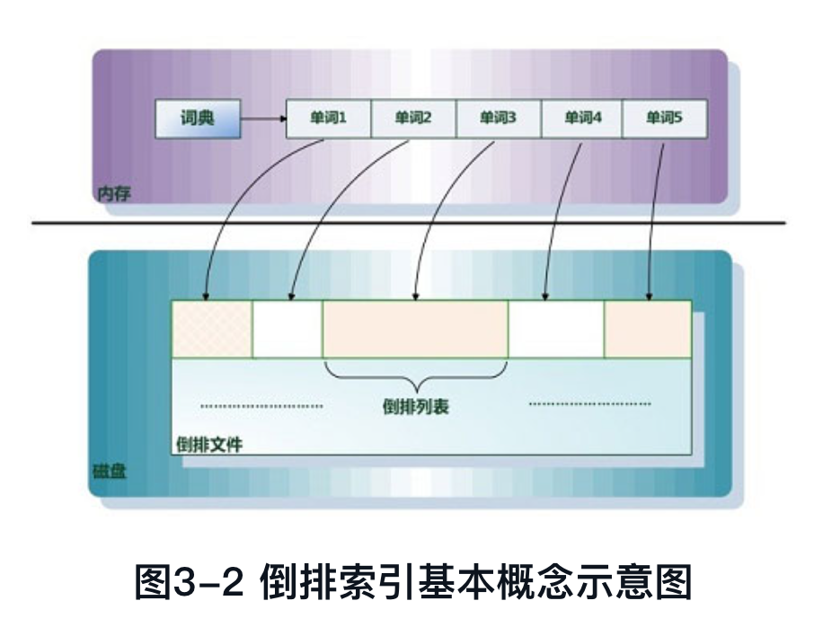

- 单词词典 Lexicon: 搜索引擎通常的索引单位是单词，单词词典是由文档集合中出现过的所有单词构成的字符串集合，单词词典内每条索引项记载单词本身的一些信息及指向倒排列表的指针。

- 倒排列表 PostingList：倒排列表用来记录有哪些文档包含了某个单词。一般在文档集合里会有很多文档包含某个单词，每个文档会记录文档编号（DocID），单词在这个文档中出现的次数（TF）及单词在文档中哪些位置出现过等信息，这样与一个文档相关的信息被称做倒排索引项（Posting），包含这个单词的一系列倒排索引项形成了列表结构，这就是某个单词对应的倒排列表。图3-9是倒排列表的示意图，在文档集合中出现过的所有单词及其对应的倒排列表组成了倒排索引。
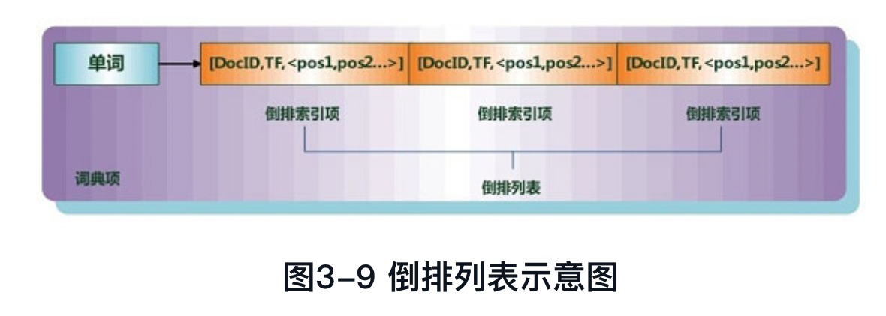

# 倒排索引生成方式

倒排索引更新方式
- 全量重建
- 增量合并：内存维护增量部分，内存吃满后和磁盘中的存量部分合并为新的全量索引。缺点是每次合并都需要一次全量的索引数据拷贝，性能较差
- 原地更新：每个单词的倒排列表预留一定空间给未来新增的列表项，有点是性能好，缺点是一旦空间不足，仍然需要执行类似数组插入的操作，会产生大量的数据复制
- 混合策略 hybrid：根据不同单词的特性进行执行不同的索引策略。例如按单词倒排列表长度划分，可以对排列表较长的单词使用原地更新策略，避免复制开销；对倒排列表较短的单词使用增量合并，避免原地更新产生的空间碎片

# 查询方式

- 一次一文档
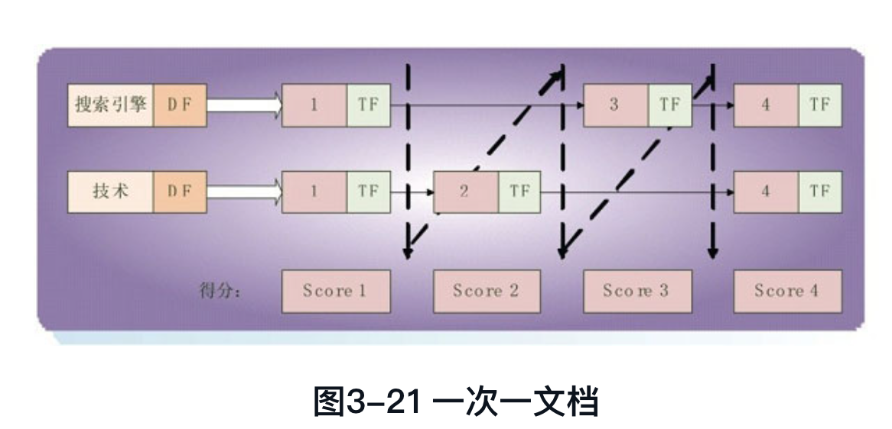

- 一次一单词
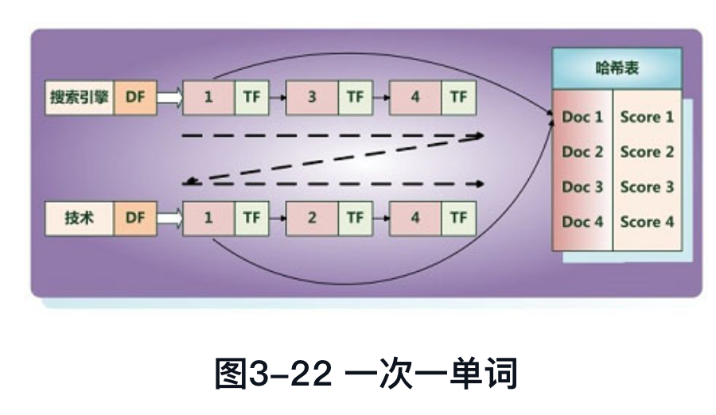

# 多字段索引

- 索引方法
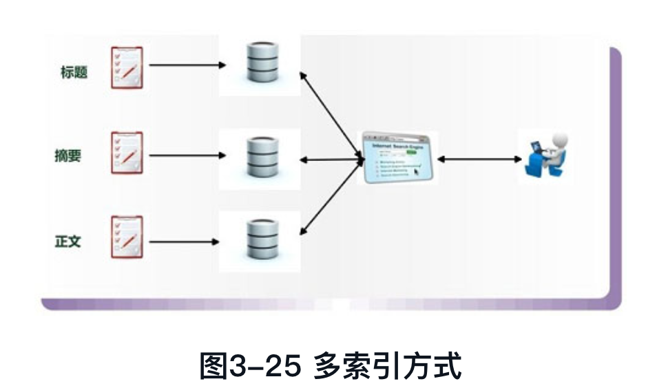

- 倒排列表方式：通过bitmap记录当前单词在文档中哪些字段出现过
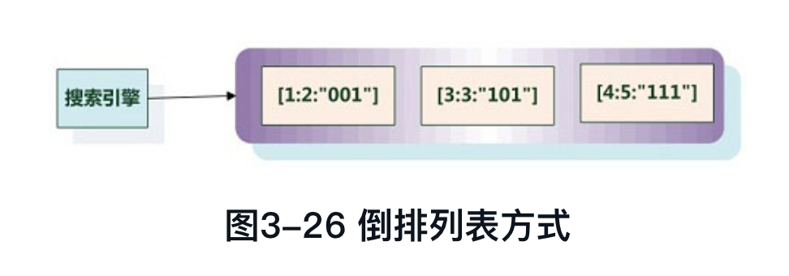

- 扩展列表方式：为每一个字段生成一个扩展列表，扩展列表中记录了每个字段在原始文档中的起止位置
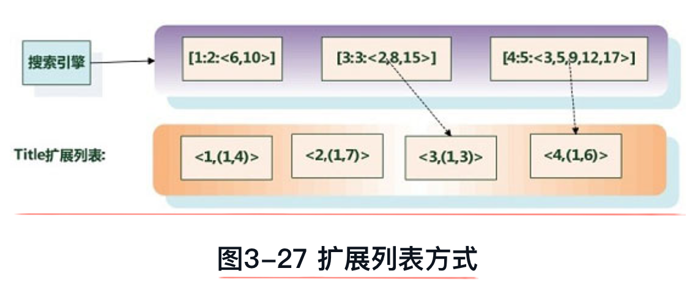

# 短语查询

- 位置索引：根据已有的索引判断待查询的的词位置关系，计算开销很大
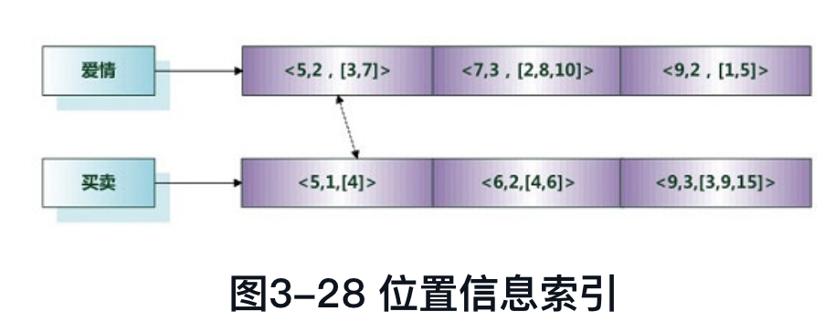

- 双词索引：构建两个词的前后关系，形成新的链表关系，会导致索引严重膨胀
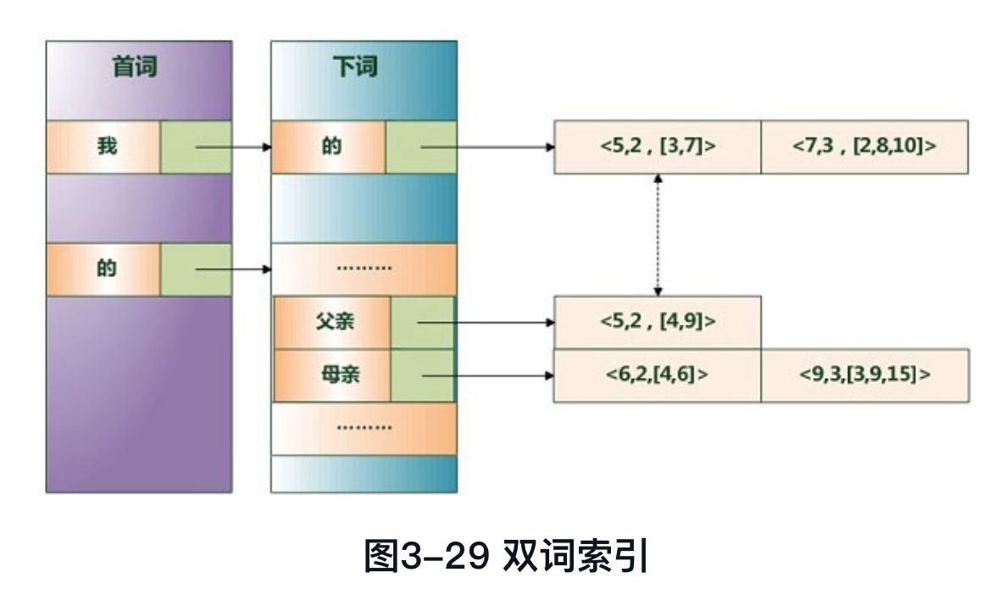

- 短语索引：直接根据短语进行分词并构建索引，全量构建仍然会导致索引膨胀，所以会通过挖掘的方法获取热点的短语，例如从用户查询日志中挖掘
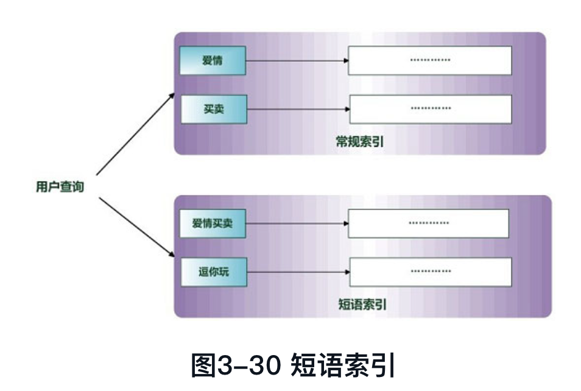

- 混合查询：对高频热点短语进行短语索引，对包含停用词的短语进行双词索引
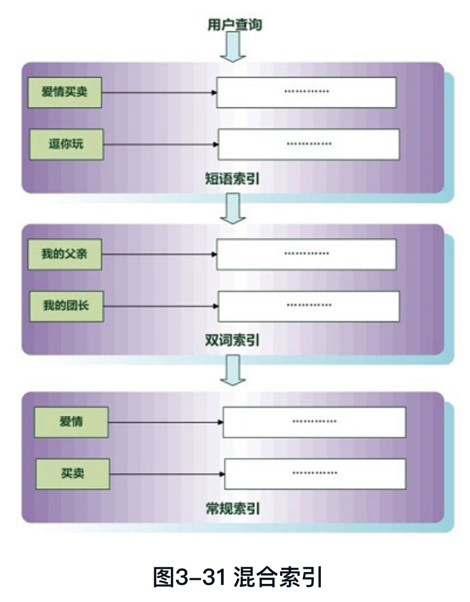

# 相关性算法

检索质量评价指标

- 精确率 & 召回率
- `p@10` 前十个结果中多大比例是和搜索相关的
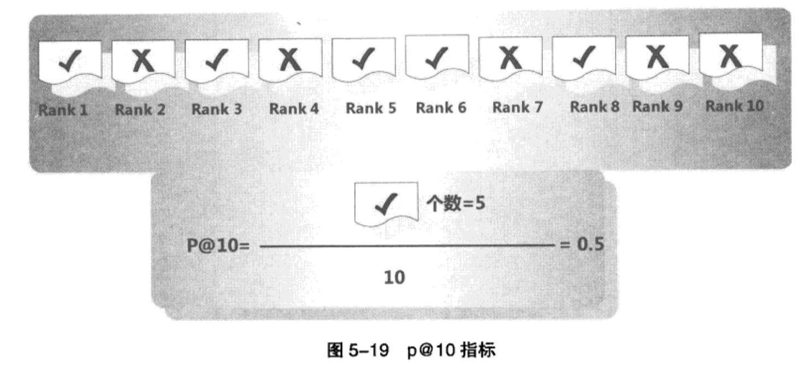
- MAP（Mean Average Precision）

# 链接分析

- PageRank：基于页面质量和入链接数量判断页面重要程度
- HITS：1. 基于Hub收集Authority页面，相互判断Hub页面和Authority页面重要程度，依赖于人工维护的Hub； 2. 用户查询后的点击结果会给对应页面升权

# 搜索引擎缓存

从缓存的数据可以分为两大部分：

1. 搜索结果缓存
2. 单词倒排列表缓存

淘汰策略和其他后台业务系统缓存基本一致，有LRU等动态缓存淘汰策略。

此外，可以结合动态缓存与静态缓存（Static and Dynamic Caching）达到较好的效果。例如，对于用户搜索的热点词后台生成长期缓存并定期刷新；其他用户的查询词使用LRU淘汰策略进行实时更新，由此达到较好的缓存效果。